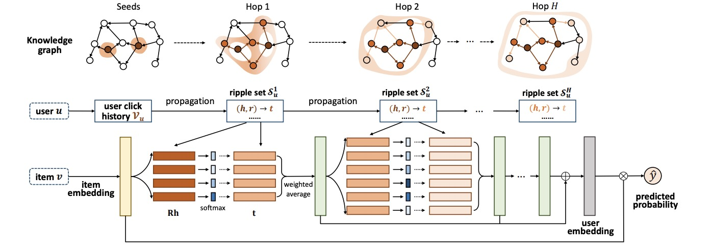

RippleNet
===========

Introduction
---------------------

`[paper] <https://dl.acm.org/doi/10.1145/3269206.3271739>`_

**Title:** RippleNet: Propagating User Preferences on the Knowledge Graph for Recommender Systems

**Authors:** Hongwei Wang, Fuzheng Zhang, Jialin Wang, Miao Zhao, Wenjie Li, Xing Xie, Minyi Guo

**Abstract:** To address the sparsity and cold start problem of collaborative filtering, researchers usually make use of side information, such as social
networks or item attributes, to improve recommendation performance. This paper considers the knowledge graph as the source of
side information. To address the limitations of existing embedding-based and path-based methods for knowledge-graph-aware recommendation, we propose RippleNet, an end-to-end framework that
naturally incorporates the knowledge graph into recommender
systems. Similar to actual ripples propagating on the water, RippleNet stimulates the propagation of user preferences over the set
of knowledge entities by automatically and iteratively extending a
user’s potential interests along links in the knowledge graph. The
multiple "ripples" activated by a user’s historically clicked items
are thus superposed to form the preference distribution of the user
with respect to a candidate item, which could be used for predicting the final clicking probability. Through extensive experiments
on real-world datasets, we demonstrate that RippleNet achieves
substantial gains in a variety of scenarios, including movie, book
and news recommendation, over several state-of-the-art baselines.

Running with RecBole
-------------------------

**Model Hyper-Parameters:**

- ``embedding_size (int)`` : The embedding size of users, items and entities. Defaults to ``64``.
- ``n_hop (int)`` : The number of hop reasoning for knowledge base. Defaults to ``2``.
- ``n_memory (int)`` : The number of memory size of every hop. Defaults to ``16``.
- ``reg_weight (float)`` : The L2 regularization weight. Defaults to ``1e-07``,
- ``kg_weight (float)`` : The kg loss weight. Defaults to ``0.01``.

**A Running Example:**

Write the following code to a python file, such as `run.py`

.. code:: python

   from recbole.quick_start import run_recbole

   run_recbole(model='RippleNet', dataset='ml-100k')

And then:

.. code:: bash

   python run.py

Tuning Hyper Parameters
-------------------------

If you want to use ``HyperTuning`` to tune hyper parameters of this model, you can copy the following settings and name it as ``hyper.test``.

.. code:: bash

   learning_rate choice [0.01,0.005,0.001,0.0005,0.0001]
   n_memory choice [4, 8. 16. 32]
   train_neg_sample_args choice [{'uniform':1}, {'uniform':2}, {'uniform':5}, {'uniform':10}]

Note that we just provide these hyper parameter ranges for reference only, and we can not guarantee that they are the optimal range of this model.

Then, with the source code of RecBole (you can download it from GitHub), you can run the ``run_hyper.py`` to tuning:

.. code:: bash

	python run_hyper.py --model=[model_name] --dataset=[dataset_name] --config_files=[config_files_path] --params_file=hyper.test

For more details about Parameter Tuning, refer to :doc:`../../../user_guide/usage/parameter_tuning`.

If you want to change parameters, dataset or evaluation settings, take a look at

- :doc:`../../../user_guide/config_settings`
- :doc:`../../../user_guide/data_intro`
- :doc:`../../../user_guide/train_eval_intro`
- :doc:`../../../user_guide/usage`