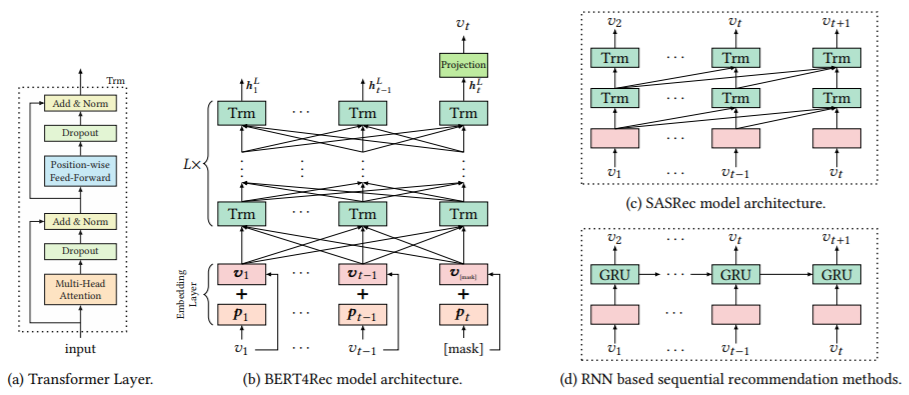

BERT4Rec
===========

Introduction
---------------------

`[paper] <https://dl.acm.org/doi/10.1145/3357384.3357895>`_

**Title:** BERT4Rec: Sequential Recommendation with Bidirectional Encoder Representations from Transformer

**Authors:** Fei Sun, Jun Liu, Jian Wu, Changhua Pei, Xiao Lin, Wenwu Ou, Peng Jiang

**Abstract:**  Modeling users' dynamic preferences from their historical behaviors is challenging and crucial for recommendation systems. Previous methods employ sequential neural networks to encode users'
historical interactions from left to right into hidden representations
for making recommendations. Despite their effectiveness, we argue
that such left-to-right unidirectional models are sub-optimal due
to the limitations including: a) unidirectional architectures restrict
the power of hidden representation in users' behavior sequences;
b) they often assume a rigidly ordered sequence which is not always
practical. To address these limitations, we proposed a sequential recommendation model called BERT4Rec, which employs the deep
bidirectional self-attention to model user behavior sequences. To
avoid the information leakage and efficiently train the bidirectional
model, we adopt the Cloze objective to sequential recommendation,
predicting the random masked items in the sequence by jointly
conditioning on their left and right context. In this way, we learn
a bidirectional representation model to make recommendations
by allowing each item in user historical behaviors to fuse information from both left and right sides. Extensive experiments on
four benchmark datasets show that our model outperforms various
state-of-the-art sequential models consistently.

Running with RecBole
-------------------------

**Model Hyper-Parameters:**

- ``hidden_size (int)`` : The number of features in the hidden state. It is also the initial embedding size of items. Defaults to ``64``.
- ``inner_size (int)`` : The inner hidden size in feed-forward layer. Defaults to ``256``.
- ``n_layers (int)`` : The number of transformer layers in transformer encoder. Defaults to ``2``.
- ``n_heads (int)`` : The number of attention heads for multi-head attention layer. Defaults to ``2``.
- ``hidden_dropout_prob (float)`` : The probability of an element to be zeroed. Defaults to ``0.5``.
- ``attn_dropout_prob (float)`` : The probability of an attention score to be zeroed. Defaults to ``0.5``.
- ``hidden_act (str)`` : The activation function in feed-forward layer. Defaults to ``'gelu'``. Range in ``['gelu', 'relu', 'swish', 'tanh', 'sigmoid']``.
- ``layer_norm_eps (float)`` : A value added to the denominator for numerical stability. Defaults to ``1e-12``.
- ``initializer_range (float)`` : The standard deviation for normal initialization. Defaults to ``0.02``.
- ``mask_ratio (float)`` : The probability for a item replaced by MASK token. Defaults to ``0.2``.
- ``loss_type (str)`` : The type of loss function. If it set to ``'CE'``, the training task is regarded as a multi-classification task and the target item is the ground truth. In this way, negative sampling is not needed. If it set to ``'BPR'``, the training task will be optimized in the pair-wise way, which maximize the difference between positive item and negative item. In this way, negative sampling is necessary, such as setting ``--neg_sampling="{'uniform':1}" ``. Defaults to ``'CE'``. Range in ``['BPR', 'CE']``.

**A Running Example:**

Write the following code to a python file, such as `run.py`

.. code:: python

   from recbole.quick_start import run_recbole

   parameter_dict = {
      'neg_sampling': None,
   }
   run_recbole(model='BERT4Rec', dataset='ml-100k', config_dict=parameter_dict)

And then:

.. code:: bash

   python run.py

Tuning Hyper Parameters
-------------------------

If you want to use ``HyperTuning`` to tune hyper parameters of this model, you can copy the following settings and name it as ``hyper.test``.

.. code:: bash

   learning_rate choice [0.01,0.005,0.001,0.0005,0.0001]
   attn_dropout_prob choice [0.2,0.5]
   hidden_dropout_prob choice [0.2,0.5]
   n_heads choice [1,2]
   n_layers choice [1,2]

Note that we just provide these hyper parameter ranges for reference only, and we can not guarantee that they are the optimal range of this model.

Then, with the source code of RecBole (you can download it from GitHub), you can run the ``run_hyper.py`` to tuning:

.. code:: bash

	python run_hyper.py --model=[model_name] --dataset=[dataset_name] --config_files=[config_files_path] --params_file=hyper.test

For more details about Parameter Tuning, refer to :doc:`../../../user_guide/usage/parameter_tuning`.

If you want to change parameters, dataset or evaluation settings, take a look at

- :doc:`../../../user_guide/config_settings`
- :doc:`../../../user_guide/data_intro`
- :doc:`../../../user_guide/train_eval_intro`
- :doc:`../../../user_guide/usage`