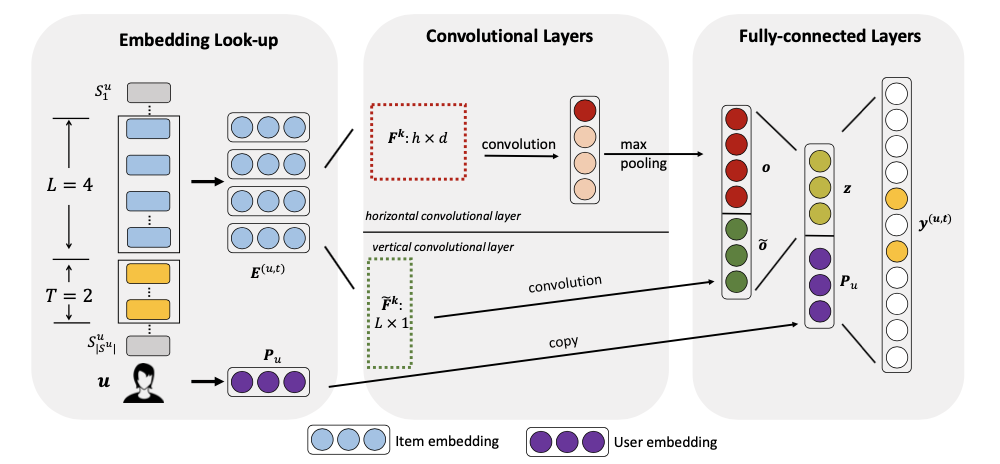

Caser
===========

Introduction
---------------------

`[paper] <https://dl.acm.org/doi/abs/10.1145/3159652.3159656>`_

**Title:** Personalized Top-N Sequential Recommendation via Convolutional Sequence Embedding

**Authors:** Jiaxi Tang, Ke Wang

**Abstract:**  Top-N sequential recommendation models each user as a sequence of items interacted in the past and aims to predict top-N ranked items that a user will likely interact in a “near future”. The order of interaction implies that sequential patterns play an important role where more recent items in a sequence have a larger impact on the next item. In this paper, we propose a Convolutional Sequence Embedding Recommendation Model (Caser) as a solution to address this requirement. The idea is to embed a sequence of recent items into an “image” in the time and latent spaces and learn sequential patterns as local features of the image using convolutional filters. This approach provides a unified and flexible network structure for capturing both general preferences and sequential patterns. The experiments on public data sets demonstrated that Caser consistently outperforms state-of-the-art sequential recommendation methods on a variety of common evaluation metrics.

Running with RecBole
-------------------------

**Model Hyper-Parameters:**

- ``embedding_size (int)`` : The embedding size of users and items. Defaults to ``64``.
- ``n_v (int)`` : The number of vertical Convolutional filters. Defaults to ``4``.
- ``n_h (int)`` : The number of horizontal Convolutional filters. Defaults to ``8``.
- ``reg_weight (float)`` : The L2 regularization weight. Defaults to ``1e-4``.
- ``dropout_prob (float)`` : The dropout rate. Defaults to ``0.4``.
- ``loss_type (str)`` : The type of loss function. If it is set to ``'CE'``, the training task is regarded as a multi-classification task and the target item is the ground truth. In this way, negative sampling is not needed. If it is set to ``'BPR'``, the training task will be optimized in the pair-wise way, which maximizes the difference between the positive item and the negative one. In this way, negative sampling is necessary, such as setting ``--train_neg_sample_args="{'distribution': 'uniform', 'sample_num': 1}"``. Defaults to ``'CE'``. Range in ``['BPR', 'CE']``.

**A Running Example:**

Write the following code to a python file, such as `run.py`

.. code:: python

   from recbole.quick_start import run_recbole

   parameter_dict = {
      'train_neg_sample_args': None,
   }
   run_recbole(model='Caser', dataset='ml-100k', config_dict=parameter_dict)

And then:

.. code:: bash

   python run.py

**Notes:**

- By setting ``reproducibility=False``, the training speed of Caser can be greatly accelerated.

Tuning Hyper Parameters
-------------------------

If you want to use ``HyperTuning`` to tune hyper parameters of this model, you can copy the following settings and name it as ``hyper.test``.

.. code:: bash

   learning_rate choice [0.01,0.005,0.001,0.0005,0.0001]
   reg_weight choice [0,1e-4,1e-5]
   dropout_prob choice [0.0,0.1,0.2,0.3,0.4,0.5]

Note that we just provide these hyper parameter ranges for reference only, and we can not guarantee that they are the optimal range of this model.

Then, with the source code of RecBole (you can download it from GitHub), you can run the ``run_hyper.py`` to tuning:

.. code:: bash

	python run_hyper.py --model=[model_name] --dataset=[dataset_name] --config_files=[config_files_path] --params_file=hyper.test

For more details about Parameter Tuning, refer to :doc:`../../../user_guide/usage/parameter_tuning`.

If you want to change parameters, dataset or evaluation settings, take a look at

- :doc:`../../../user_guide/config_settings`
- :doc:`../../../user_guide/data_intro`
- :doc:`../../../user_guide/train_eval_intro`
- :doc:`../../../user_guide/usage`

