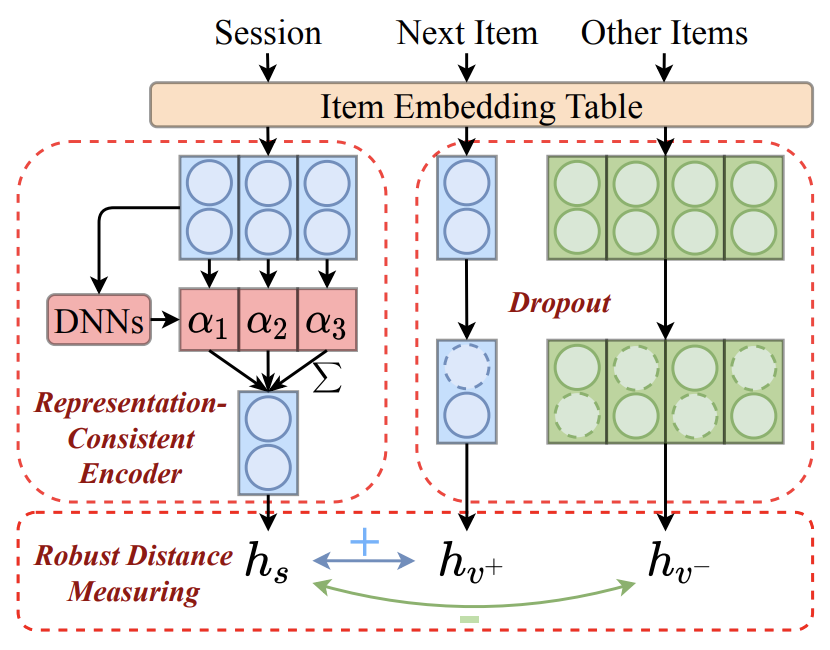

CORE
============

Introduction
------------------

`[paper] <https://arxiv.org/abs/2204.11067>`_

**Title:** CORE: Simple and Effective Session-based Recommendation within Consistent Representation Space

**Authors:** Yupeng Hou, Binbin Hu, Zhiqiang Zhang, Wayne Xin Zhao

**Abstract:**
Session-based Recommendation (SBR) refers to the task of predicting the next item based on short-term user behaviors within an anonymous session. However, session embedding learned by a non-linear encoder is usually not in the same representation space as item embeddings, resulting in the inconsistent prediction issue while recommending items. To address this issue, we propose a simple and effective framework named CORE, which can unify the representation space for both the encoding and decoding processes. Firstly, we design a representation-consistent encoder that takes the linear combination of input item embeddings as session embedding, guaranteeing that sessions and items are in the same representation space. Besides, we propose a robust distance measuring method to prevent overfitting of embeddings in the consistent representation space. Extensive experiments conducted on five public real-world datasets demonstrate the effectiveness and efficiency of the proposed method. The code is available at: https://github.com/RUCAIBox/CORE.

Running with RecBole
-------------------------

**Model Hyper-Parameters:**

- ``embedding_size (int)`` : The number of features in the hidden state. It is also the initial embedding size of item. Defaults to ``64``.
- ``inner_size (int)`` : The inner hidden size in feed-forward layer. Defaults to ``256``.
- ``n_layers (int)`` : The number of transformer layers in transformer encoder. Defaults to ``2``.
- ``n_heads (int)`` : The number of attention heads for multi-head attention layer. Defaults to ``2``.
- ``hidden_dropout_prob (float)`` : The probability of an element to be zeroed. Defaults to ``0.5``.
- ``attn_dropout_prob (float)`` : The probability of an attention score to be zeroed. Defaults to ``0.5``.
- ``hidden_act (str)`` : The activation function in feed-forward layer. Defaults to ``'gelu'``. Range in ``['gelu', 'relu', 'swish', 'tanh', 'sigmoid']``.
- ``layer_norm_eps (float)`` : A value added to the denominator for numerical stability. Defaults to ``1e-12``.
- ``initializer_range (float)`` : The standard deviation for normal initialization. Defaults to 0.02``.
- ``loss_type (str)`` : The type of loss function. If it is set to ``'CE'``, the training task is regarded as a multi-classification task and the target item is the ground truth. In this way, negative sampling is not needed. If it is set to ``'BPR'``, the training task will be optimized in the pair-wise way, which maximizes the difference between the positive item and the negative one. In this way, negative sampling is necessary, such as setting ``--train_neg_sample_args="{'distribution': 'uniform', 'sample_num': 1}"``. Defaults to ``'CE'``. Range in ``['BPR', 'CE']``.
- ``dnn_type (str)`` : The type of DNN. If it set to ``'trm'``, CORE will leverage a Transformer encoder to learn weights. If it set to ``ave``, CORE will simply use mean pooling for session encoding. Defaults to ``'trm'``. Range in ``['trm', 'ave']``.
- ``sess_dropout (float)`` : The probability of an element of item embeddings in a session to be zeroed. Defaults to ``0.2``.
- ``item_dropout (float)`` : The probability of an element of candidate item embeddings to be zeroed. Defaults to ``0.2``.
- ``temperature (float)`` : Temperature for contrastive loss. Defaults to ``0.07``.

**A Running Example:**

Write the following code to a python file, such as `run.py`

.. code:: python

   from recbole.quick_start import run_recbole

   parameter_dict = {
      'train_neg_sample_args': None,
   }
   run_recbole(model='CORE', dataset='ml-100k', config_dict=parameter_dict)

And then:

.. code:: bash

   python run.py

Tuning Hyper Parameters
-------------------------

If you want to use ``HyperTuning`` to tune hyper parameters of this model, you can copy the following settings and name it as ``hyper.test``.

.. code:: bash
  
   learning_rate choice [0.001, 0.0001]
   n_layers choice [1, 2]
   hidden_dropout_prob choice [0.2, 0.5]
   attn_dropout_prob choice [0.2, 0.5]

Note that we just provide these hyper parameter ranges for reference only, and we can not guarantee that they are the optimal range of this model.

Then, with the source code of RecBole (you can download it from GitHub), you can run the ``run_hyper.py`` to tuning:

.. code:: bash

	python run_hyper.py --model=[model_name] --dataset=[dataset_name] --config_files=[config_files_path] --params_file=hyper.test

For more details about Parameter Tuning, refer to :doc:`../../../user_guide/usage/parameter_tuning`.

If you want to change parameters, dataset or evaluation settings, take a look at

- :doc:`../../../user_guide/config_settings`
- :doc:`../../../user_guide/data_intro`
- :doc:`../../../user_guide/train_eval_intro`
- :doc:`../../../user_guide/usage`
