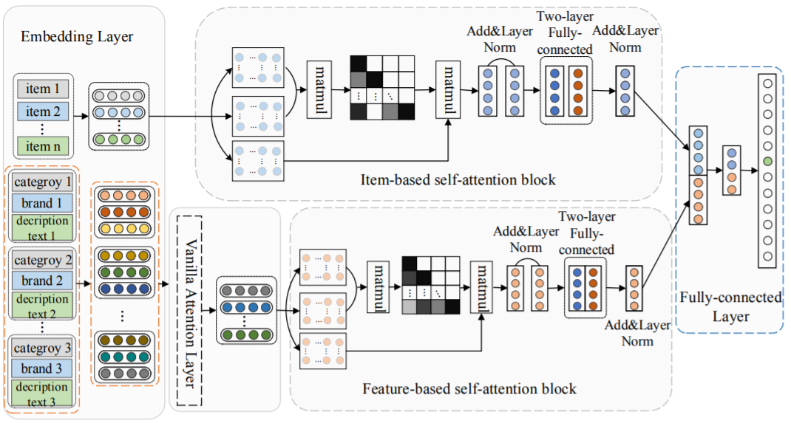

FDSA
===========

Introduction
---------------------

`[paper] <https://www.ijcai.org/Proceedings/2019/600>`_

**Title:** Feature-level Deeper Self-Attention Network for Sequential Recommendation

**Authors:** Tingting Zhang, Pengpeng Zhao, Yanchi Liu, Victor S. Sheng, Jiajie Xu, Deqing Wang, Guanfeng Liu, Xiaofang Zhou

**Abstract:**  Sequential recommendation, which aims to recommend next item that the user will
likely interact in a near future, has become essential in various Internet applications.
Existing methods usually consider the transition patterns between items, but ignore the
transition patterns between features of items. We argue that only the item-level sequences
cannot reveal the full sequential patterns, while explicit and implicit feature-level
sequences can help extract the full sequential patterns. In this paper, we propose a novel
method named Feature-level Deeper Self-Attention Network (FDSA) for sequential recommendation.
Specifically, FDSA first integrates various heterogeneous features of items into feature
sequences with different weights through a vanilla mechanism. After that, FDSA applies
separated self-attention blocks on item-level sequences and feature-level sequences,
respectively, to model item transition patterns and feature transition patterns.
Then, we integrate the outputs of these two blocks to a fully-connected layer for next item recommendation.
Finally, comprehensive experimental results demonstrate that considering the transition relationships between
features can significantly improve the performance of sequential recommendation.

Running with RecBole
-------------------------

**Model Hyper-Parameters:**

- ``hidden_size (int)`` : The number of features in the hidden state. It is also the initial embedding size of items. Defaults to ``64``.
- ``inner_size (int)`` : The inner hidden size in feed-forward layer. Defaults to ``256``.
- ``n_layers (int)`` : The number of transformer layers in transformer encoder. Defaults to ``2``.
- ``n_heads (int)`` : The number of attention heads for multi-head attention layer. Defaults to ``2``.
- ``hidden_dropout_prob (float)`` : The probability of an element to be zeroed. Defaults to ``0.5``.
- ``attn_dropout_prob (float)`` : The probability of an attention score to be zeroed. Defaults to ``0.5``.
- ``hidden_act (str)`` : The activation function in feed-forward layer. Defaults to ``'gelu'``. Range in ``['gelu', 'relu', 'swish', 'tanh', 'sigmoid']``.
- ``layer_norm_eps (float)`` : A value added to the denominator for numerical stability. Defaults to ``1e-12``.
- ``initializer_range (float)`` : The standard deviation for normal initialization. Defaults to ``0.02``.
- ``selected_features (list)`` : The list of selected item features. Defaults to ``['class']`` for ml-100k dataset.
- ``pooling_mode (str)``: The intra-feature pooling mode. Defaults to ``'mean'``. Range in ``['max', 'mean', 'sum']``.
- ``loss_type (str)`` : The type of loss function. If it set to ``'CE'``, the training task is regarded as a multi-classification task and the target item is the ground truth. In this way, negative sampling is not needed. If it set to ``'BPR'``, the training task will be optimized in the pair-wise way, which maximize the difference between positive item and negative item. In this way, negative sampling is necessary, such as setting ``--neg_sampling="{'uniform': 1}"``. Defaults to ``'CE'``. Range in ``['BPR', 'CE']``.

**A Running Example:**

Write the following code to a python file, such as `run.py`

.. code:: python

   from recbole.quick_start import run_recbole

   parameter_dict = {
      'neg_sampling': None,
   }
   run_recbole(model='FDSA', dataset='ml-100k', config_dict=parameter_dict)

And then:

.. code:: bash

   python run.py

**Notes:**

- FDSA is a sequential model that integrates item context information. ``selected_features`` controls the used item context information. The used context information must be in the dataset and be loaded by data module in RecBole. It means the value in ``selected_features`` must appear in ``load_col``.

Tuning Hyper Parameters
-------------------------

If you want to use ``HyperTuning`` to tune hyper parameters of this model, you can copy the following settings and name it as ``hyper.test``.

.. code:: bash

   learning_rate choice [0.01,0.005,0.001,0.0005,0.0001]
   attn_dropout_prob choice [0.2, 0.5]
   hidden_dropout_prob choice [0.2, 0.5]
   n_heads choice [1, 2]
   n_layers choice [1,2,3]

Note that we just provide these hyper parameter ranges for reference only, and we can not guarantee that they are the optimal range of this model.

Then, with the source code of RecBole (you can download it from GitHub), you can run the ``run_hyper.py`` to tuning:

.. code:: bash

	python run_hyper.py --model=[model_name] --dataset=[dataset_name] --config_files=[config_files_path] --params_file=hyper.test

For more details about Parameter Tuning, refer to :doc:`../../../user_guide/usage/parameter_tuning`.

If you want to change parameters, dataset or evaluation settings, take a look at

- :doc:`../../../user_guide/config_settings`
- :doc:`../../../user_guide/data_intro`
- :doc:`../../../user_guide/train_eval_intro`
- :doc:`../../../user_guide/usage`