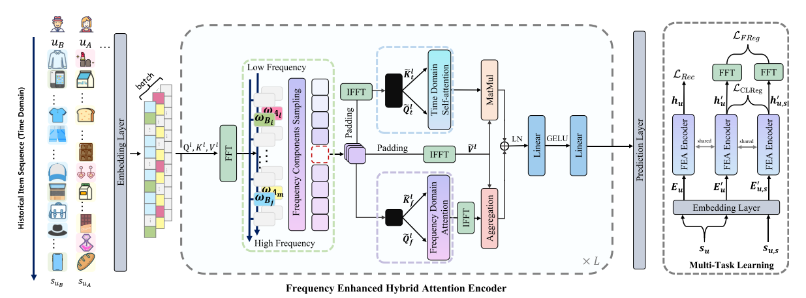

FEARec
===========

Introduction
---------------------

`[paper] <https://dl.acm.org/doi/10.1145/3539618.3591689>`_

**Title:** FEARec: Frequency Enhanced Hybrid Attention Network for Sequential Recommendation

**Authors:** Xinyu Du, Huanhuan Yuan, Pengpeng Zhao, Jianfeng Qu, Fuzhen Zhuang, Guanfeng Liu, Victor S. Sheng

**Abstract:**  The self-attention mechanism, which equips with a strong capability of modeling long-range dependencies, is one of the extensively used techniques in the sequential recommendation field. However, many recent studies represent that current self-attention based models are low-pass filters and are inadequate to capture high-frequency information. Furthermore, since the items in the user behaviors are intertwined with each other, these models are incomplete to distinguish the inherent periodicity obscured in the time domain. In this work, we shift the perspective to the frequency domain, and propose a novel Frequency Enhanced Hybrid Attention Network for Sequential Recommendation, namely FEARec. In this model, we firstly improve the original time domain self-attention in the frequency domain with a ramp structure to make both low-frequency and high-frequency information could be explicitly learned in our approach. Moreover, we additionally design a similar attention mechanism via auto-correlation in the frequency domain to capture the periodic characteristics and fuse the time and frequency level attention in a union model. Finally, both contrastive learning and frequency regularization are utilized to ensure that multiple views are aligned in both the time domain and frequency domain. Extensive experiments conducted on four widely used benchmark

Running with RecBole
-------------------------

**Model Hyper-Parameters:**

- ``hidden_size (int)`` : The number of features in the hidden state. It is also the initial embedding size of items. Defaults to ``64``.
- ``inner_size (int)`` : The inner hidden size in feed-forward layer. Defaults to ``256``.
- ``n_layers (int)`` : The number of transformer layers in transformer encoder. Defaults to ``2``.
- ``n_heads (int)`` : The number of attention heads for multi-head attention layer. Defaults to ``2``.
- ``hidden_dropout_prob (float)`` : The probability of an element to be zeroed. Defaults to ``0.5``.
- ``attn_dropout_prob (float)`` : The probability of an attention score to be zeroed. Defaults to ``0.5``.
- ``hidden_act (str)`` : The activation function in feed-forward layer. Defaults to ``'gelu'``. Range in ``['gelu', 'relu', 'swish', 'tanh', 'sigmoid']``.
- ``layer_norm_eps (float)`` : A value added to the denominator for numerical stability. Defaults to ``1e-12``.
- ``initializer_range (float)`` : The standard deviation for normal initialization. Defaults to ``0.02``.
- ``loss_type (str)`` : The type of loss function. If it is set to ``'CE'``, the training task is regarded as a multi-classification task and the target item is the ground truth. In this way, negative sampling is not needed. If it is set to ``'BPR'``, the training task will be optimized in the pair-wise way, which maximizes the difference between the positive item and the negative one. In this way, negative sampling is necessary, such as setting ``--train_neg_sample_args="{'distribution': 'uniform', 'sample_num': 1}"``. Defaults to ``'CE'``. Range in ``['BPR', 'CE']``.
- ``lmd (int) `` : The weight of unsupervised normalized CE loss.Defaults to ``0.1``.
- ``lmd_sem (int) `` : The weight of supervised normalized CE loss.Defaults to ``0.1``.
- ``global_ratio (float)`` : The ratio of frequency components. Defaults to ``1``.
- ``dual_domain (bool)`` : Frequency domain processing or not. Defaults to ``False``.
- ``std (bool)`` : Use the specific time index or not. Defaults to ``False``.
- ``fredom (bool)`` : Regularization in the frequency domain or not. Defaults to ``False``.
- ``spatial_ratio (float)`` : The ratio of the spatial domain and frequency domain. Defaults to ``0``.
- ``topk_factor (int)`` : To aggregate time delayed sequences with high autocorrelation. Defaults to ``1``.
- ``fredom_type (str)`` : The type of loss in different scenarios. Defaults to ``None``. Range in ``['un', 'su', 'us', 'us_x']``.

**A Running Example:**

Write the following code to a python file, such as `run.py`

.. code:: python

   from recbole.quick_start import run_recbole

   parameter_dict = {
      'train_neg_sample_args': None,
   }

   run_recbole(model='FEARec', dataset='ml-100k')

And then:

.. code:: bash

   python run.py

Tuning Hyper Parameters
-------------------------

If you want to use ``HyperTuning`` to tune hyper parameters of this model, you can copy the following settings and name it as ``hyper.test``.

.. code:: bash

    global_ratio choice [0.6,0.8,1.0]
    topk_factor choice [1,3,5]
    spatial_ratio choice [0.1,0.9]

Note that we just provide these hyper parameter ranges for reference only, and we can not guarantee that they are the optimal range of this model.

Then, with the source code of RecBole (you can download it from GitHub), you can run the ``run_hyper.py`` to tuning:

.. code:: bash

	python run_hyper.py --model=[model_name] --dataset=[dataset_name] --config_files=[config_files_path] --params_file=hyper.test

For more details about Parameter Tuning, refer to :doc:`../../../user_guide/usage/parameter_tuning`.

If you want to change parameters, dataset or evaluation settings, take a look at

- :doc:`../../../user_guide/config_settings`
- :doc:`../../../user_guide/data_intro`
- :doc:`../../../user_guide/train_eval_intro`
- :doc:`../../../user_guide/usage`