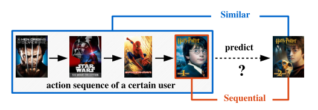

FOSSIL
===========

Introduction
---------------------

`[paper] <https://ieeexplore.ieee.org/abstract/document/7837843/>`_

**Title:** FOSSIL: Fusing Similarity Models with Markov Chains for Sparse Sequential Recommendation.

**Authors:** Ruining He

**Abstract:**  Abstract—Predicting personalized sequential behavior is a
key task for recommender systems. In order to predict user
actions such as the next product to purchase, movie to watch,
or place to visit, it is essential to take into account both long-term 
user preferences and sequential patterns (i.e., short-term
dynamics). Matrix Factorization and Markov Chain methods
have emerged as two separate but powerful paradigms for
modeling the two respectively. Combining these ideas has led
to unified methods that accommodate long- and short-term
dynamics simultaneously by modeling pairwise user-item and
item-item interactions.
In spite of the success of such methods for tackling dense
data, they are challenged by sparsity issues, which are prevalent
in real-world datasets. In recent years, similarity-based methods
have been proposed for (sequentially-unaware) item recommendation with promising results on sparse datasets. In this
paper, we propose to fuse such methods with Markov Chains to
make personalized sequential recommendations. We evaluate
our method, Fossil, on a variety of large, real-world datasets.
We show quantitatively that Fossil outperforms alternative
algorithms, especially on sparse datasets, and qualitatively
that it captures personalized dynamics and is able to make
meaningful recommendations.

Running with RecBole
-------------------------

**Model Hyper-Parameters:**

- ``embedding_size (int)`` : The embedding size of users and items. Defaults to ``64``.
- ``order_len (int)`` : The last N items . Defaults to ``3``.
- ``reg_weight (float)`` : The L2 regularization weight. Defaults to ``0.00``.
- ``alpha (float)`` : The parameter of alpha in calculate the similarity. Defaults to ``0.6``.
- ``loss_type (str)`` : The type of loss function. If it set to ``'CE'``, the training task is regarded as a multi-classification task and the target item is the ground truth. In this way, negative sampling is not needed. If it set to ``'BPR'``, the training task will be optimized in the pair-wise way, which maximize the difference between positive item and negative item. In this way, negative sampling is necessary, such as setting ``--neg_sampling="{'uniform': 1}"``. Defaults to ``'CE'``. Range in ``['BPR', 'CE']``.

**A Running Example:**

Write the following code to a python file, such as `run.py`

.. code:: python

   from recbole.quick_start import run_recbole

   parameter_dict = {
      'neg_sampling': None,
   }
   run_recbole(model='FOSSIL', dataset='ml-100k', config_dict=parameter_dict)

And then:

.. code:: bash

   python run.py

**Notes:**

- By setting ``reproducibility=False``, the training speed of FOSSIL can be greatly accelerated.

Tuning Hyper Parameters
-------------------------

If you want to use ``HyperTuning`` to tune hyper parameters of this model, you can copy the following settings and name it as ``hyper.test``.

.. code:: bash

   learning_rate choice [0.01,0.001]
   embedding_size choice [64]
   reg_weight choice [0,0.0001]
   order_len choice [1,2,3,5]
   alpha choice [0.2,0.5,0.6]

Note that we just provide these hyper parameter ranges for reference only, and we can not guarantee that they are the optimal range of this model.

Then, with the source code of RecBole (you can download it from GitHub), you can run the ``run_hyper.py`` to tuning:

.. code:: bash

	python run_hyper.py --model=[model_name] --dataset=[dataset_name] --config_files=[config_files_path] --params_file=hyper.test

For more details about Parameter Tuning, refer to :doc:`../../../user_guide/usage/parameter_tuning`.

If you want to change parameters, dataset or evaluation settings, take a look at

- :doc:`../../../user_guide/config_settings`
- :doc:`../../../user_guide/data_intro`
- :doc:`../../../user_guide/train_eval_intro`
- :doc:`../../../user_guide/usage`

