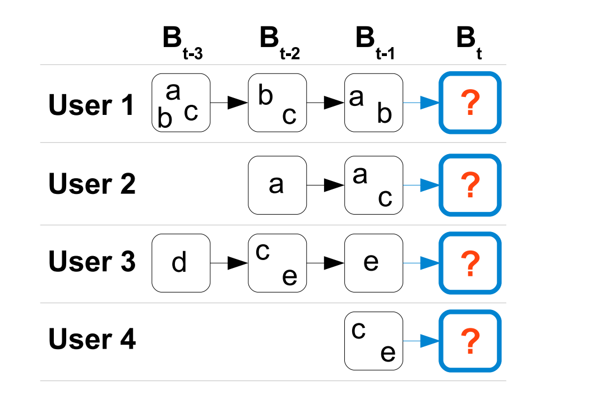

FPMC
===========

Introduction
---------------------

`[paper] <https://dl.acm.org/doi/10.1145/1772690.1772773>`_

**Title:** Factorizing personalized Markov chains for next-basket recommendation

**Authors:** Steffen Rendle, Christoph Freudenthaler, Lars Schmidt-Thieme

**Abstract:**  Recommender systems are an important component of many
websites. Two of the most popular approaches are based on
matrix factorization (MF) and Markov chains (MC). MF
methods learn the general taste of a user by factorizing the
matrix over observed user-item preferences. On the other
hand, MC methods model sequential behavior by learning a
transition graph over items that is used to predict the next
action based on the recent actions of a user. In this paper, we
present a method bringing both approaches together. Our
method is based on personalized transition graphs over underlying Markov chains. That means for each user an own
transition matrix is learned – thus in total the method uses
a transition cube. As the observations for estimating the
transitions are usually very limited, our method factorizes
the transition cube with a pairwise interaction model which
is a special case of the Tucker Decomposition. We show
that our factorized personalized MC (FPMC) model subsumes both a common Markov chain and the normal matrix
factorization model. For learning the model parameters, we
introduce an adaption of the Bayesian Personalized Ranking
(BPR) framework for sequential basket data. Empirically,
we show that our FPMC model outperforms both the common matrix factorization and the unpersonalized MC model
both learned with and without factorization.

Running with RecBole
-------------------------

**Model Hyper-Parameters:**

- ``embedding_size (int)`` : The embedding size of users and items. Defaults to ``64``.
- ``loss_type (str)`` : The type of loss function. It is set to ``'BPR'``, the training task will be optimized in the pair-wise way, which maximizes the difference between the positive item and the negative one. In this way, negative sampling is necessary, such as setting ``--train_neg_sample_args="{'distribution': 'uniform', 'sample_num': 1}"``. Defaults to ``'BPR'``. Range in ``['BPR']``.

**A Running Example:**

Write the following code to a python file, such as `run.py`

.. code:: python

   from recbole.quick_start import run_recbole

   parameter_dict = {
      'train_neg_sample_args': None,
   }
   run_recbole(model='FPMC', dataset='ml-100k', config_dict=parameter_dict)

And then:

.. code:: bash

   python run.py

**Notes:**

- Different from other sequential models, FPMC must be optimized in pair-wise way using negative sampling, so it needs ``train_neg_sample_args="{'distribution': 'uniform', 'sample_num': 1}"``.

Tuning Hyper Parameters
-------------------------

If you want to use ``HyperTuning`` to tune hyper parameters of this model, you can copy the following settings and name it as ``hyper.test``.

.. code:: bash

   learning_rate choice [0.01,0.005,0.001,0.0005,0.0001]
 
Note that we just provide these hyper parameter ranges for reference only, and we can not guarantee that they are the optimal range of this model.

Then, with the source code of RecBole (you can download it from GitHub), you can run the ``run_hyper.py`` to tuning:

.. code:: bash

	python run_hyper.py --model=[model_name] --dataset=[dataset_name] --config_files=[config_files_path] --params_file=hyper.test

For more details about Parameter Tuning, refer to :doc:`../../../user_guide/usage/parameter_tuning`.

If you want to change parameters, dataset or evaluation settings, take a look at

- :doc:`../../../user_guide/config_settings`
- :doc:`../../../user_guide/data_intro`
- :doc:`../../../user_guide/train_eval_intro`
- :doc:`../../../user_guide/usage`

