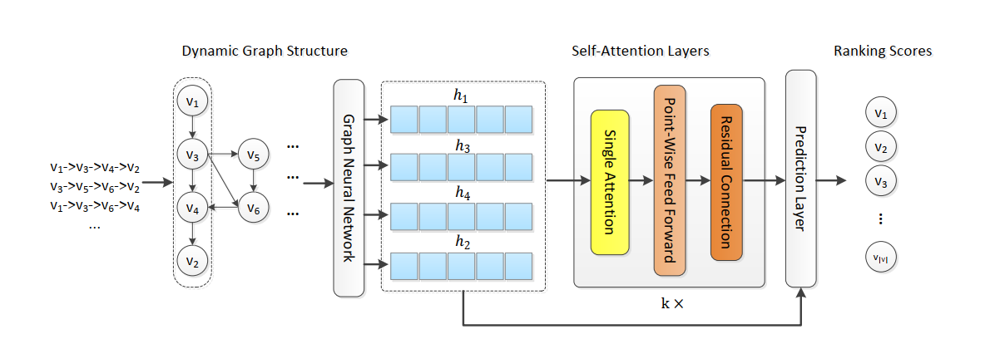

GCSAN
===========

Introduction
---------------------

`[paper] <https://www.ijcai.org/Proceedings/2019/547>`_

**Title:** Graph Contextualized Self-Attention Network for Session-based Recommendation

**Authors:** Chengfeng Xu, Pengpeng Zhao, Yanchi Liu, Victor S. Sheng, Jiajie Xu, Fuzhen Zhuang, Junhua Fang, Xiaofang Zhou

**Abstract:**  Session-based recommendation, which aims to predict the user’s immediate next action based on
anonymous sessions, is a key task in many online
services (e:g:; e-commerce, media streaming). Recently, Self-Attention Network (SAN) has achieved
significant success in various sequence modeling
tasks without using either recurrent or convolutional network. However, SAN lacks local dependencies that exist over adjacent items and limits its capacity for learning contextualized representations of items in sequences. In this paper, we propose a graph contextualized self-attention model
(GC-SAN), which utilizes both graph neural network and self-attention mechanism, for session-based recommendation. In GC-SAN, we dynamically construct a graph structure for session sequences and capture rich local dependencies via graph neural network (GNN). Then each session learns long-range dependencies by applying
the self-attention mechanism. Finally, each session
is represented as a linear combination of the global
preference and the current interest of that session.
Extensive experiments on two real-world datasets show that GC-SAN outperforms state-of-the-art
methods consistently.

Running with RecBole
-------------------------

**Model Hyper-Parameters:**

- ``hidden_size (int)`` : The number of features in the hidden state. It is also the initial embedding size of item. Defaults to ``64``.
- ``inner_size (int)`` : The inner hidden size in feed-forward layer. Defaults to ``256``.
- ``n_layers (int)`` : The number of transformer layers in transformer encoder. Defaults to ``2``.
- ``n_heads (int)`` : The number of attention heads for multi-head attention layer. Defaults to ``2``.
- ``hidden_dropout_prob (float)`` : The probability of an element to be zeroed. Defaults to ``0.5``.
- ``attn_dropout_prob (float)`` : The probability of an attention score to be zeroed. Defaults to ``0.5``.
- ``hidden_act (str)`` : The activation function in feed-forward layer. Defaults to ``'gelu'``. Range in ``['gelu', 'relu', 'swish', 'tanh', 'sigmoid']``.
- ``layer_norm_eps (float)`` : A value added to the denominator for numerical stability. Defaults to ``1e-12``.
- ``initializer_range (float)`` : The standard deviation for normal initialization. Defaults to ``0.02``.
- ``step (int)`` : The number of layers in GNN. Defaults to ``1``.
- ``weight (float)`` : The weight parameter controls the contribution of self-attention representation and the last-clicked action, the original paper suggests that setting w to a value of 0.4 to 0.8 is more desirable. Defaults to ``0.6``.
- ``reg_weight (float)`` : The L2 regularization weight. Defaults to ``[5e-5]``.
- ``loss_type (str)`` : The type of loss function. If it is set to ``'CE'``, the training task is regarded as a multi-classification task and the target item is the ground truth. In this way, negative sampling is not needed. If it is set to ``'BPR'``, the training task will be optimized in the pair-wise way, which maximizes the difference between the positive item and the negative one. In this way, negative sampling is necessary, such as setting ``--train_neg_sample_args="{'distribution': 'uniform', 'sample_num': 1}"``. Defaults to ``'CE'``. Range in ``['BPR', 'CE']``.

**A Running Example:**

Write the following code to a python file, such as `run.py`

.. code:: python

   from recbole.quick_start import run_recbole

   parameter_dict = {
      'train_neg_sample_args': None,
   }
   run_recbole(model='GCSAN', dataset='ml-100k', config_dict=parameter_dict)

And then:

.. code:: bash

   python run.py

Tuning Hyper Parameters
-------------------------

If you want to use ``HyperTuning`` to tune hyper parameters of this model, you can copy the following settings and name it as ``hyper.test``.

.. code:: bash

   learning_rate choice [0.01,0.005,0.001,0.0005,0.0001]
   step choice [1]
   n_layers choice [1]
   n_heads choice [1]
   hidden_size choice [64]
   inner_size choice [256]
   hidden_dropout_prob choice [0.2]
   attn_dropout_prob choice [0.2]
   hidden_act choice ['gelu']
   layer_norm_eps choice [1e-12]
   initializer_range choice [0.02]
   weight choice [0.5,0.6]
   reg_weight choice [5e-5]
 
Note that we just provide these hyper parameter ranges for reference only, and we can not guarantee that they are the optimal range of this model.

Then, with the source code of RecBole (you can download it from GitHub), you can run the ``run_hyper.py`` to tuning:

.. code:: bash

	python run_hyper.py --model=[model_name] --dataset=[dataset_name] --config_files=[config_files_path] --params_file=hyper.test

For more details about Parameter Tuning, refer to :doc:`../../../user_guide/usage/parameter_tuning`.

If you want to change parameters, dataset or evaluation settings, take a look at

- :doc:`../../../user_guide/config_settings`
- :doc:`../../../user_guide/data_intro`
- :doc:`../../../user_guide/train_eval_intro`
- :doc:`../../../user_guide/usage`
