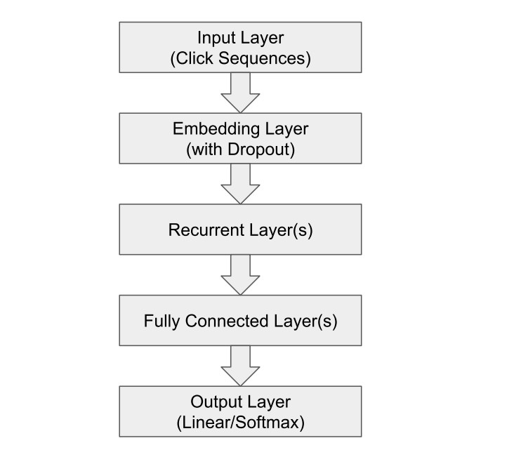

GRU4Rec
=================

Introduction
---------------------

`[paper] <https://dl.acm.org/doi/10.1145/2988450.2988452>`_

**Title:** Improved Recurrent Neural Networks for Session-based Recommendations

**Authors:** Yong Kiam Tan, Xinxing Xu, Yong Liu

**Abstract:**  Recurrent neural networks (RNNs) were recently proposed
for the session-based recommendation task. The models
showed promising improvements over traditional recommendation approaches. In this work, we further study RNNbased models for session-based recommendations. We propose the application of two techniques to improve model
performance, namely, data augmentation, and a method to
account for shifts in the input data distribution. We also
empirically study the use of generalised distillation, and a
novel alternative model that directly predicts item embeddings. Experiments on the RecSys Challenge 2015 dataset
demonstrate relative improvements of 12.8% and 14.8% over
previously reported results on the Recall\@20 and Mean Reciprocal Rank\@20 metrics respectively.

Running with RecBole
-------------------------

**Model Hyper-Parameters:**

- ``embedding_size (int)`` : The embedding size of items. Defaults to ``64``.
- ``hidden_size (int)`` : The number of features in the hidden state. Defaults to ``128``.
- ``num_layers (int)`` : The number of layers in GRU. Defaults to ``1``.
- ``dropout_prob (float)``: The dropout rate. Defaults to ``0.3``.
- ``loss_type (str)`` : The type of loss function. If it set to ``'CE'``, the training task is regarded as a multi-classification task and the target item is the ground truth. In this way, negative sampling is not needed. If it set to ``'BPR'``, the training task will be optimized in the pair-wise way, which maximize the difference between positive item and negative item. In this way, negative sampling is necessary, such as setting ``--neg_sampling="{'uniform': 1}"``. Defaults to ``'CE'``. Range in ``['BPR', 'CE']``.

**A Running Example:**

Write the following code to a python file, such as `run.py`

.. code:: python

   from recbole.quick_start import run_recbole

   parameter_dict = {
      'neg_sampling': None,
   }
   run_recbole(model='GRU4Rec', dataset='ml-100k', config_dict=parameter_dict)

And then:

.. code:: bash

   python run.py

Tuning Hyper Parameters
-------------------------

If you want to use ``HyperTuning`` to tune hyper parameters of this model, you can copy the following settings and name it as ``hyper.test``.

.. code:: bash

   learning_rate choice [0.01,0.005,0.001,0.0005,0.0001]
   dropout_prob choice [0.0,0.1,0.2,0.3,0.4,0.5]
   num_layers choice [1,2,3]
   hidden_size choice [128]

Note that we just provide these hyper parameter ranges for reference only, and we can not guarantee that they are the optimal range of this model.

Then, with the source code of RecBole (you can download it from GitHub), you can run the ``run_hyper.py`` to tuning:

.. code:: bash

	python run_hyper.py --model=[model_name] --dataset=[dataset_name] --config_files=[config_files_path] --params_file=hyper.test

For more details about Parameter Tuning, refer to :doc:`../../../user_guide/usage/parameter_tuning`.

If you want to change parameters, dataset or evaluation settings, take a look at

- :doc:`../../../user_guide/config_settings`
- :doc:`../../../user_guide/data_intro`
- :doc:`../../../user_guide/train_eval_intro`
- :doc:`../../../user_guide/usage`
