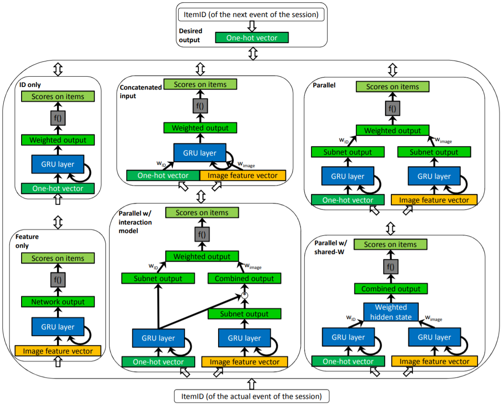

GRU4RecF
===========

Introduction
---------------------

`[paper] <https://dl.acm.org/doi/10.1145/2959100.2959167>`_

**Title:** Parallel Recurrent Neural Network Architectures for
Feature-rich Session-based Recommendations

**Authors:** Balázs Hidasi, Massimo Quadrana, Alexandros Karatzoglou, Domonkos Tikk

**Abstract:**  Real-life recommender systems often face the daunting task
of providing recommendations based only on the clicks of
a user session. Methods that rely on user profiles – such
as matrix factorization – perform very poorly in this setting, thus item-to-item recommendations are used most of
the time. However the items typically have rich feature representations such as pictures and text descriptions that can
be used to model the sessions. Here we investigate how these
features can be exploited in Recurrent Neural Network based
session models using deep learning. We show that obvious
approaches do not leverage these data sources. We thus introduce a number of parallel RNN (p-RNN) architectures to
model sessions based on the clicks and the features (images
and text) of the clicked items. We also propose alternative
training strategies for p-RNNs that suit them better than
standard training. We show that p-RNN architectures with
proper training have significant performance improvements
over feature-less session models while all session-based models outperform the item-to-item type baseline.

Running with RecBole
-------------------------

**Model Hyper-Parameters:**

- ``embedding_size (int)`` : The embedding size of items. Defaults to ``64``.
- ``hidden_size (int)`` : The number of features in the hidden state. Defaults to ``128``.
- ``num_layers (int)`` : The number of layers in GRU. Defaults to ``1``.
- ``dropout_prob (float)`` : The dropout rate. Defaults to ``0.3``.
- ``selected_features (list)`` : The list of selected item features. Defaults to ``['class']`` for ml-100k dataset.
- ``pooling_mode (str)`` : The intra-feature pooling mode. Defaults to ``'sum'``. Range in ``['max', 'mean', 'sum']``.
- ``loss_type (str)`` : The type of loss function. If it set to ``'CE'``, the training task is regarded as a multi-classification task and the target item is the ground truth. In this way, negative sampling is not needed. If it set to ``'BPR'``, the training task will be optimized in the pair-wise way, which maximize the difference between positive item and negative item. In this way, negative sampling is necessary, such as setting ``--neg_sampling="{'uniform': 1}"``. Defaults to ``'CE'``. Range in ``['BPR', 'CE']``.

**A Running Example:**

Write the following code to a python file, such as `run.py`

.. code:: python

   from recbole.quick_start import run_recbole

   parameter_dict = {
      'neg_sampling': None,
   }
   run_recbole(model='GRU4RecF', dataset='ml-100k', config_dict=parameter_dict)

And then:

.. code:: bash

   python run.py

**Notes:**

- GRU4RecF is a sequential model that integrates item context information. ``selected_features`` controls the used item context information. The used context information must be in the dataset and be loaded by data module in RecBole. It means the value in ``selected_features`` must appear in ``load_col``.

Tuning Hyper Parameters
-------------------------

If you want to use ``HyperTuning`` to tune hyper parameters of this model, you can copy the following settings and name it as ``hyper.test``.

.. code:: bash

   learning_rate choice [0.01,0.005,0.001,0.0005,0.0001]
   num_layers choice [1, 2]

Note that we just provide these hyper parameter ranges for reference only, and we can not guarantee that they are the optimal range of this model.

Then, with the source code of RecBole (you can download it from GitHub), you can run the ``run_hyper.py`` to tuning:

.. code:: bash

	python run_hyper.py --model=[model_name] --dataset=[dataset_name] --config_files=[config_files_path] --params_file=hyper.test

For more details about Parameter Tuning, refer to :doc:`../../../user_guide/usage/parameter_tuning`.

If you want to change parameters, dataset or evaluation settings, take a look at

- :doc:`../../../user_guide/config_settings`
- :doc:`../../../user_guide/data_intro`
- :doc:`../../../user_guide/train_eval_intro`
- :doc:`../../../user_guide/usage`
