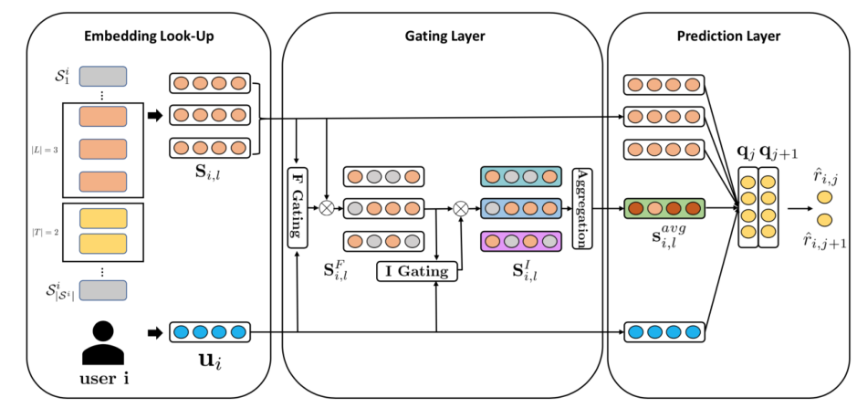

HGN
===========

Introduction
---------------------

`[paper] <https://dl.acm.org/doi/abs/10.1145/3292500.3330984>`_

**Title:** HGN: Hierarchical Gating Networks for Sequential Recommendation.

**Authors:** Chen Ma

**Abstract:**  The chronological order of user-item interactions is a key feature
in many recommender systems, where the items that users will
interact may largely depend on those items that users just accessed
recently. However, with the tremendous increase of users and items,
sequential recommender systems still face several challenging problems: (1) the hardness of modeling the long-term user interests from
sparse implicit feedback; (2) the difficulty of capturing the short-term 
user interests given several items the user just accessed. To
cope with these challenges, we propose a hierarchical gating network 
(HGN), integrated with the Bayesian Personalized Ranking
(BPR) to capture both the long-term and short-term user interests.
Our HGN consists of a feature gating module, an instance gating
module, and an item-item product module. In particular, our feature
gating and instance gating modules select what item features can
be passed to the downstream layers from the feature and instance
levels, respectively. Our item-item product module explicitly captures the item relations between the items that users accessed in
the past and those items users will access in the future. We extensively evaluate our model with several state-of-the-art methods
and different validation metrics on five real-world datasets. The
experimental results demonstrate the effectiveness of our model on
Top-N sequential recommendation.

Running with RecBole
-------------------------

**Model Hyper-Parameters:**

- ``embedding_size (int)`` : The embedding size of users and items. Defaults to ``64``.
- ``pooling_type (str)`` : The type of pooling include average pooling and max pooling . Defaults to ``average``.
- ``reg_weight (float)`` : The L2 regularization weight. Defaults to ``[0.00,0.00]``.
- ``loss_type (str)`` : The type of loss function. If it set to ``'CE'``, the training task is regarded as a multi-classification task and the target item is the ground truth. In this way, negative sampling is not needed. If it set to ``'BPR'``, the training task will be optimized in the pair-wise way, which maximize the difference between positive item and negative item. In this way, negative sampling is necessary, such as setting ``--neg_sampling="{'uniform': 1}"``. Defaults to ``'CE'``. Range in ``['BPR', 'CE']``.

**A Running Example:**

Write the following code to a python file, such as `run.py`

.. code:: python

   from recbole.quick_start import run_recbole

   run_recbole(model='HGN', dataset='ml-100k')

And then:

.. code:: bash

   python run.py

**Notes:**

- By setting ``reproducibility=False``, the training speed of HGN can be greatly accelerated.

Tuning Hyper Parameters
-------------------------

If you want to use ``HyperTuning`` to tune hyper parameters of this model, you can copy the following settings and name it as ``hyper.test``.

.. code:: bash

   learning_rate choice [0.01,0.001]
   embedding_size choice [64]
   pooling_type choice ["average","max"]
   reg_weight choice ['[0.00,0.00]','[0.001,0.00001]']

Note that we just provide these hyper parameter ranges for reference only, and we can not guarantee that they are the optimal range of this model.

Then, with the source code of RecBole (you can download it from GitHub), you can run the ``run_hyper.py`` to tuning:

.. code:: bash

	python run_hyper.py --model=[model_name] --dataset=[dataset_name] --config_files=[config_files_path] --params_file=hyper.test

For more details about Parameter Tuning, refer to :doc:`../../../user_guide/usage/parameter_tuning`.

If you want to change parameters, dataset or evaluation settings, take a look at

- :doc:`../../../user_guide/config_settings`
- :doc:`../../../user_guide/data_intro`
- :doc:`../../../user_guide/train_eval_intro`
- :doc:`../../../user_guide/usage`

