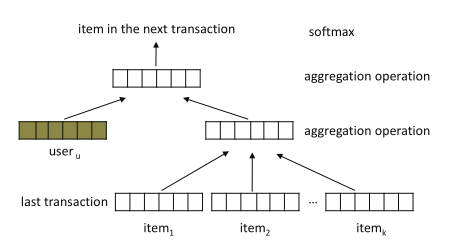

HRM
===========

Introduction
---------------------

`[paper] <https://dl.acm.org/doi/abs/10.1145/2766462.2767694>`_

**Title:** HRM: Learning Hierarchical Representation Model for Next Basket Recommendation.

**Authors:** Pengfei Wang

**Abstract:**  Next basket recommendation is a crucial task in market basket 
analysis. Given a user's purchase history, usually a sequence of transaction data, one attempts to build a 
recommender that can predict the next few items that the user 
most probably would like. Ideally, a good recommender
should be able to explore the sequential behavior (i.e., buying 
one item leads to buying another next), as well as account 
for users' general taste (i.e., what items a user is typically interested in) for recommendation. Moreover, these
two factors may interact with each other to influence users'
next purchase. To tackle the above problems, in this paper, 
we introduce a novel recommendation approach, namely 
hierarchical representation model (HRM). HRM can well
capture both sequential behavior and users' general taste by
involving transaction and user representations in prediction.
Meanwhile, the flexibility of applying different aggregation
operations, especially nonlinear operations, on representations allows us to model complicated interactions among
different factors. Theoretically, we show that our model
subsumes several existing methods when choosing proper
aggregation operations. Empirically, we demonstrate that
our model can consistently outperform the state-of-the-art
baselines under different evaluation metrics on real-world
transaction data.

Running with RecBole
-------------------------

**Model Hyper-Parameters:**

- ``embedding_size (int)`` : The embedding size of users and items. Defaults to ``64``.
- ``high_order (int)`` : The last N items . Defaults to ``2``.
- ``pooling_type_layer_1 (str)`` : The type of pooling in the first floor include average pooling and max pooling . Defaults to ``max``.
- ``pooling_type_layer_2 (str)`` : The type of pooling in the second floor include average pooling and max pooling . Defaults to ``max``.
- ``dropout_prob (float)`` : The dropout rate. Defaults to ``0.2``.
- ``loss_type (str)`` : The type of loss function. If it is set to ``'CE'``, the training task is regarded as a multi-classification task and the target item is the ground truth. In this way, negative sampling is not needed. If it is set to ``'BPR'``, the training task will be optimized in the pair-wise way, which maximizes the difference between the positive item and the negative one. In this way, negative sampling is necessary, such as setting ``--train_neg_sample_args="{'distribution': 'uniform', 'sample_num': 1}"``. Defaults to ``'CE'``. Range in ``['BPR', 'CE']``.

**A Running Example:**

Write the following code to a python file, such as `run.py`

.. code:: python

   from recbole.quick_start import run_recbole

   parameter_dict = {
      'train_neg_sample_args': None,
   }
   run_recbole(model='HRM', dataset='ml-100k', config_dict=parameter_dict)

And then:

.. code:: bash

   python run.py

**Notes:**

- By setting ``reproducibility=False``, the training speed of HRM can be greatly accelerated.

Tuning Hyper Parameters
-------------------------

If you want to use ``HyperTuning`` to tune hyper parameters of this model, you can copy the following settings and name it as ``hyper.test``.

.. code:: bash

   learning_rate choice [0.001]
   embedding_size choice [64]
   high_order choice [1,2,4]
   dropout_prob choice [0.2]
   pooling_type_layer_1 choice ["max","average"]
   pooling_type_layer_2 choice ["max","average"]

Note that we just provide these hyper parameter ranges for reference only, and we can not guarantee that they are the optimal range of this model.

Then, with the source code of RecBole (you can download it from GitHub), you can run the ``run_hyper.py`` to tuning:

.. code:: bash

	python run_hyper.py --model=[model_name] --dataset=[dataset_name] --config_files=[config_files_path] --params_file=hyper.test

For more details about Parameter Tuning, refer to :doc:`../../../user_guide/usage/parameter_tuning`.

If you want to change parameters, dataset or evaluation settings, take a look at

- :doc:`../../../user_guide/config_settings`
- :doc:`../../../user_guide/data_intro`
- :doc:`../../../user_guide/train_eval_intro`
- :doc:`../../../user_guide/usage`

