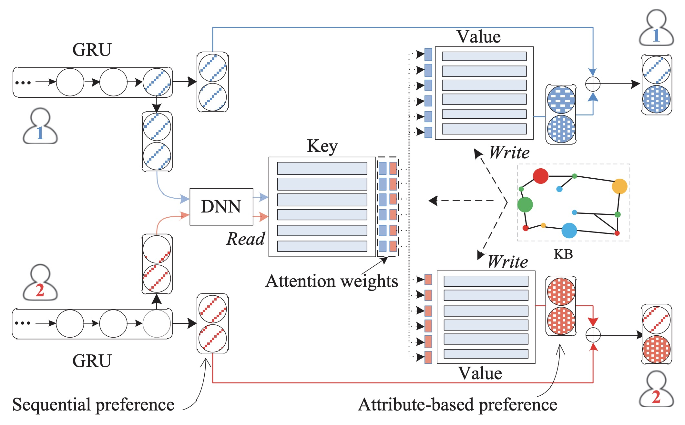

KSR
===========

Introduction
---------------------

`[paper] <https://dl.acm.org/doi/10.1145/3209978.3210017>`_

**Title:** Improving Sequential Recommendation with Knowledge-Enhanced Memory Networks

**Authors:** Jin Huang, Wayne Xin Zhao, Hongjian Dou, Ji-Rong Wen, Edward Y. Chang

**Abstract:**  With the revival of neural networks, many studies try to adapt powerful sequential neural models, ıe Recurrent Neural Networks (RNN), to sequential recommendation. RNN-based networks encode historical interaction records into a hidden state vector. Although the state vector is able to encode sequential dependency, it still has limited representation power in capturing complicated user preference. It is difficult to capture fine-grained user preference from the interaction sequence. Furthermore, the latent vector representation is usually hard to understand and explain. To address these issues, in this paper, we propose a novel knowledge enhanced sequential recommender. Our model integrates the RNN-based networks with Key-Value Memory Network (KV-MN). We further incorporate knowledge base (KB) information to enhance the semantic representation of KV-MN. RNN-based models are good at capturing sequential user preference, while knowledge-enhanced KV-MNs are good at capturing attribute-level user preference. By using a hybrid of RNNs and KV-MNs, it is expected to be endowed with both benefits from these two components. The sequential preference representation together with the attribute-level preference representation are combined as the final representation of user preference. With the incorporation of KB information, our model is also highly interpretable. To our knowledge, it is the first time that sequential recommender is integrated with external memories by leveraging large-scale KB information.

Running with RecBole
-------------------------

**Model Hyper-Parameters:**

- ``embedding_size (int)`` : The embedding size of items and the KG feature. Defaults to ``64``.
- ``hidden_size (int)`` : The number of features in the hidden state. Defaults to ``128``.
- ``num_layers (int)`` : The number of layers in GRU. Defaults to ``1``.
- ``dropout_prob (float)`` : The dropout rate. Defaults to ``0.1``.
- ``freeze_kg (bool)`` : Whether to freeze the pre-trained knowledge embedding feature. Defaults to ``True``.
- ``gamma (float)`` : The scaling factor used in read operation when calculating the attention weights of user preference on attributes. Defaults to ``10``.
- ``loss_type (str)`` : The type of loss function. If it set to ``'CE'``, the training task is regarded as a multi-classification task and the target item is the ground truth. In this way, negative sampling is not needed. If it set to ``'BPR'``, the training task will be optimized in the pair-wise way, which maximize the difference between positive item and negative item. In this way, negative sampling is necessary, such as setting ``--neg_sampling="{'uniform': 1}"``. Defaults to ``'CE'``. Range in ``['BPR', 'CE']``.

**A Running Example:**

Write the following code to a python file, such as `run.py`

.. code:: python

   from recbole.quick_start import run_recbole

   parameter_dict = {
      'neg_sampling': None,
   }
   run_recbole(model='KSR', dataset='ml-100k', config_dict=parameter_dict)

And then:

.. code:: bash

   python run.py

**Notes:**

- If you want to run KSR, please prepare pretrained knowledge graph embedding and add the following settings to config files:

   .. code:: yaml

        load_col:
            inter: [user_id, item_id]
            kg: [head_id, relation_id, tail_id]
            link: [item_id, entity_id]
            ent_feature: [ent_id, ent_vec]
            rel_feature: [rel_id, rel_vec]
        alias_of_entity_id: [ent_id]
        alias_of_relation_id: [rel_id]
        preload_weight:
            ent_id: ent_vec
            rel_id: rel_vec
        additional_feat_suffix: [ent_feature, rel_feature]

  where the pretrained knowledge graph embedding should be stored in file named [dataset_name].ent_feature. If you want to
  add additional feature embedding, please refer to this example.

Tuning Hyper Parameters
-------------------------

If you want to use ``HyperTuning`` to tune hyper parameters of this model, you can copy the following settings and name it as ``hyper.test``.

.. code:: bash

   learning_rate choice [0.01,0.005,0.001,0.0005,0.0001]
   dropout_prob choice [0.0,0.1,0.2,0.3,0.4,0.5]
   num_layers choice [1,2,3]
   hidden_size choice [128]
   freeze_kg choice [True, False]

Note that we just provide these hyper parameter ranges for reference only, and we can not guarantee that they are the optimal range of this model.

Then, with the source code of RecBole (you can download it from GitHub), you can run the ``run_hyper.py`` to tuning:

.. code:: bash

	python run_hyper.py --model=[model_name] --dataset=[dataset_name] --config_files=[config_files_path] --params_file=hyper.test

For more details about Parameter Tuning, refer to :doc:`../../../user_guide/usage/parameter_tuning`.

If you want to change parameters, dataset or evaluation settings, take a look at

- :doc:`../../../user_guide/config_settings`
- :doc:`../../../user_guide/data_intro`
- :doc:`../../../user_guide/train_eval_intro`
- :doc:`../../../user_guide/usage`