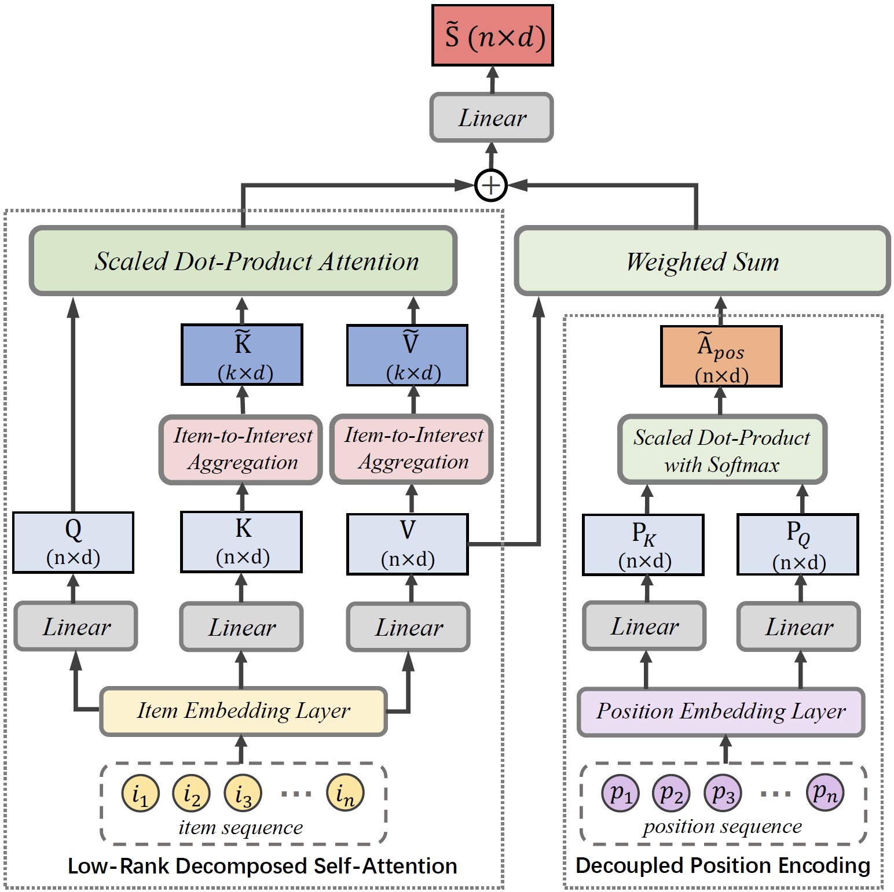

LightSANs
=================

Introduction
---------------------

`[paper] <https://doi.org/10.1145/3404835.3462978>`_

**Title:** Lighter and Better: Low-Rank Decomposed Self-Attention Networks for Next-Item Recommendation

**Authors:** Xinyan Fan, Zheng Liu, Jianxun Lian, Wayne Xin Zhao, Xing Xie, and Ji-Rong Wen

**Abstract:**  Self-attention networks (SANs) have been intensively applied for sequential recommenders,
but they are limited due to: (1) the quadratic complexity and vulnerability to over-parameterization
in self-attention; (2) inaccurate modeling of sequential relations between items due
to the implicit position encoding. In this work, we propose the low-rank decomposed
self-attention networks (LightSANs) to overcome these problems. Particularly, we introduce
the low-rank decomposed self-attention, which projects user's historical items into
a small constant number of latent interests and leverages item-to-interest interaction
to generate the context-aware representation. It scales linearly w.r.t. the user's
historical sequence length in terms of time and space, and is more resilient to over-parameterization.
Besides, we design the decoupled position encoding, which models the sequential relations
between items more precisely. Extensive experimental studies are carried out on three
real-world datasets, where LightSANs outperform the existing SANs-based recommenders
in terms of both effectiveness and efficiency.

Running with RecBole
-------------------------

**Model Hyper-Parameters:**

- ``n_layers (int)`` : The number of transformer layers in transformer encoder. Default to ``2``.
- ``n_heads (int)`` : The number of attention heads for multi-head attention layer. Defaults to ``2``.
- ``k_interests (int)`` : The number of latent interests dimension in item-to-interest aggregation. Defaults to ``5``. We recommend setting `k_interests=0.1*MAX_ITEM_LIST_LENGTH` to ensure the compression effect.
- ``hidden_size (int)`` : The input and output hidden size. Defaults to ``64``.
- ``inner_size (int)`` : The imensionality in feed-forward layer. Defaults to ``256``.
- ``hidden_dropout_prob (float)``: The probability of an element to be zeroed. Defaults to ``0.5``.
- ``attn_dropout_prob (float)``: The probability of an attention score to be zeroed. Defaults to ``0.5``.
- ``hidden_act (str)`` : The activation function in feed-forward layer. Defaults to ``'gelu'``. Range in ``['gelu', 'relu', 'swish', 'tanh', 'sigmoid']``.
- ``layer_norm_eps (float)``: The value added to the denominator for numerical stability. Defaults to ``1e-12``.
- ``initializer_range (float)``: The range of weights initialization. Defaults to ``0.02``.
- ``loss_type (str)`` : The type of loss function. If it is set to ``'CE'``, the training task is regarded as a multi-classification task and the target item is the ground truth. In this way, negative sampling is not needed. If it is set to ``'BPR'``, the training task will be optimized in the pair-wise way, which maximizes the difference between the positive item and the negative one. In this way, negative sampling is necessary, such as setting ``--train_neg_sample_args="{'distribution': 'uniform', 'sample_num': 1}"``. Defaults to ``'CE'``. Range in ``['BPR', 'CE']``.

**A Running Example:**

Write the following code to a python file, such as `run.py`

.. code:: python

   from recbole.quick_start import run_recbole

   parameter_dict = {
      'train_neg_sample_args': None,
   }
   run_recbole(model='LightSANs', dataset='ml-100k', config_dict=parameter_dict)

And then:

.. code:: bash

   python run.py

Tuning Hyper Parameters
-------------------------

If you want to use ``HyperTuning`` to tune hyper parameters of this model, you can copy the following settings and name it as ``hyper.test``.

.. code:: bash

   learning_rate choice [0.01,0.005,0.001,0.0005,0.0001]
   num_layers choice [1,2,3]
   k_interests choice [10,15,20]

Note that we just provide these hyper parameter ranges for reference only, and we can not guarantee that they are the optimal range of this model.

Then, with the source code of RecBole (you can download it from GitHub), you can run the ``run_hyper.py`` to tuning:

.. code:: bash

	python run_hyper.py --model=[model_name] --dataset=[dataset_name] --config_files=[config_files_path] --params_file=hyper.test

For more details about Parameter Tuning, refer to :doc:`../../../user_guide/usage/parameter_tuning`.

If you want to change parameters, dataset or evaluation settings, take a look at

- :doc:`../../../user_guide/config_settings`
- :doc:`../../../user_guide/data_intro`
- :doc:`../../../user_guide/train_eval_intro`
- :doc:`../../../user_guide/usage`
