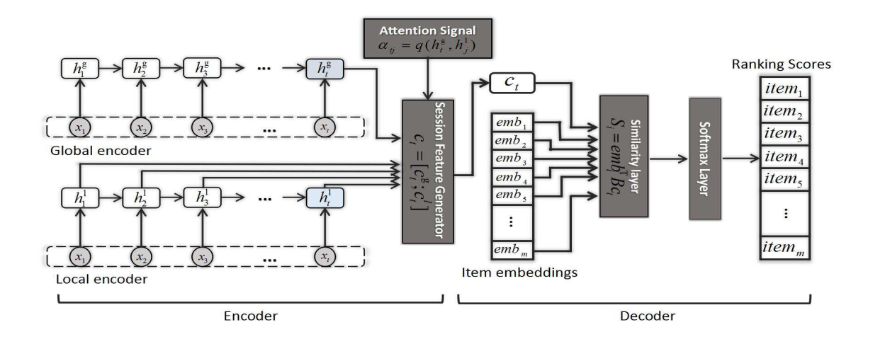

NARM
===========

Introduction
---------------------

`[paper] <https://dl.acm.org/doi/10.1145/3132847.3132926>`_

**Title:** Neural Attentive Session-based Recommendation

**Authors:** Jing Li, Pengjie Ren, Zhumin Chen, Zhaochun Ren, Tao Lian, Jun Ma

**Abstract:**  Given e-commerce scenarios that user profiles are invisible, session-based recommendation is proposed to generate recommendation
results from short sessions. Previous work only considers the
user’s sequential behavior in the current session, whereas the
user’s main purpose in the current session is not emphasized. In
this paper, we propose a novel neural networks framework, i.e.,
Neural Attentive Recommendation Machine (NARM), to tackle
this problem. Specifically, we explore a hybrid encoder with an
attention mechanism to model the user’s sequential behavior and
capture the user’s main purpose in the current session, which
are combined as a unified session representation later. We then
compute the recommendation scores for each candidate item with
a bi-linear matching scheme based on this unified session representation. We train NARM by jointly learning the item and session
representations as well as their matchings. We carried out extensive experiments on two benchmark datasets. Our experimental
results show that NARM outperforms state-of-the-art baselines on
both datasets. Furthermore, we also find that NARM achieves a
significant improvement on long sessions, which demonstrates its
advantages in modeling the user’s sequential behavior and main
purpose simultaneously.

Running with RecBole
-------------------------

**Model Hyper-Parameters:**

- ``embedding_size (int)`` : The embedding size of items. Defaults to ``64``.
- ``hidden_size (int)`` : The number of features in the hidden state. Defaults to ``128``.
- ``n_layers (int)`` : The number of layers in GRU. Defaults to ``1``.
- ``dropout_probs (list of float)`` : The dropout rate, there are two values,
  the former is for embedding layer and the latter is for concatenation of the vector obtained by the local encoder and the vector obtained by the global encoder. Defaults to ``[0.25,0.5]``.
- ``loss_type (str)`` : The type of loss function. If it is set to ``'CE'``, the training task is regarded as a multi-classification task and the target item is the ground truth. In this way, negative sampling is not needed. If it is set to ``'BPR'``, the training task will be optimized in the pair-wise way, which maximizes the difference between the positive item and the negative one. In this way, negative sampling is necessary, such as setting ``--train_neg_sample_args="{'distribution': 'uniform', 'sample_num': 1}"``. Defaults to ``'CE'``. Range in ``['BPR', 'CE']``.

**A Running Example:**

Write the following code to a python file, such as `run.py`

.. code:: python

   from recbole.quick_start import run_recbole

   parameter_dict = {
      'train_neg_sample_args': None,
   }
   run_recbole(model='NARM', dataset='ml-100k', config_dict=parameter_dict)

And then:

.. code:: bash

   python run.py

Tuning Hyper Parameters
-------------------------

If you want to use ``HyperTuning`` to tune hyper parameters of this model, you can copy the following settings and name it as ``hyper.test``.

.. code:: bash

   learning_rate choice [0.01,0.005,0.001,0.0005,0.0001]
   hidden_size choice [128]
   n_layers choice [1,2]
   dropout_probs choice ['[0.25,0.5]','[0.2,0.2]','[0.1,0.2]']

Note that we just provide these hyper parameter ranges for reference only, and we can not guarantee that they are the optimal range of this model.

Then, with the source code of RecBole (you can download it from GitHub), you can run the ``run_hyper.py`` to tuning:

.. code:: bash

	python run_hyper.py --model=[model_name] --dataset=[dataset_name] --config_files=[config_files_path] --params_file=hyper.test

For more details about Parameter Tuning, refer to :doc:`../../../user_guide/usage/parameter_tuning`.

If you want to change parameters, dataset or evaluation settings, take a look at

- :doc:`../../../user_guide/config_settings`
- :doc:`../../../user_guide/data_intro`
- :doc:`../../../user_guide/train_eval_intro`
- :doc:`../../../user_guide/usage`