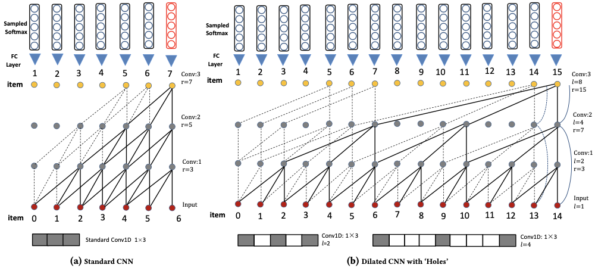

NextItNet
===========

Introduction
---------------------

`[paper] <https://dl.acm.org/doi/abs/10.1145/3289600.3290975>`_

**Title:** A Simple Convolutional Generative Network for Next Item Recommendation

**Authors:** Fajie Yuan, Alexandros Karatzoglou, Ioannis Arapakis, Joemon M Jose, Xiangnan He

**Abstract:**  Convolutional Neural Networks (CNNs) have been recently introduced in the domain of session-based next item recommendation. An ordered collection of past items the user has interacted with in a session (or sequence) are embedded into a 2-dimensional latent matrix, and treated as an image. The convolution and pooling operations are then applied to the mapped item embeddings. In this paper, we first examine the typical session-based CNN recommender and show that both the generative model and network architecture are suboptimal when modeling long-range dependencies in the item sequence. To address the issues, we introduce a simple, but very effective generative model that is capable of learning high-level representation from both short- and long-range item dependencies. The network architecture of the proposed model is formed of a stack of holed convolutional layers, which can efficiently increase the receptive fields without relying on the pooling operation. Another contribution is the effective use of residual block structure in recommender systems, which can ease the optimization for much deeper networks. The proposed generative model attains state-of-the-art accuracy with less training time in the next item recommendation task. It accordingly can be used as a powerful recommendation baseline to beat in future, especially when there are long sequences of user feedback.

Running with RecBole
-------------------------

**Model Hyper-Parameters:**

- ``embedding_size (int)`` : The embedding size of users and items. Defaults to ``64``.
- ``kernel_size (int)`` : The width of convolutional filter. Defaults to ``3``.
- ``block_num (int)`` : The number of residual blocks. Defaults to ``5``.
- ``dilations (list)`` : Control the spacing between the kernel points. Defaults to ``[1,4]``.
- ``reg_weight (float)`` : The L2 regularization weight. Defaults to ``1e-5``.
- ``loss_type (str)`` : The type of loss function. If it is set to ``'CE'``, the training task is regarded as a multi-classification task and the target item is the ground truth. In this way, negative sampling is not needed. If it is set to ``'BPR'``, the training task will be optimized in the pair-wise way, which maximizes the difference between the positive item and the negative one. In this way, negative sampling is necessary, such as setting ``--train_neg_sample_args="{'distribution': 'uniform', 'sample_num': 1}"``. Defaults to ``'CE'``. Range in ``['BPR', 'CE']``.

**A Running Example:**

Write the following code to a python file, such as `run.py`

.. code:: python

   from recbole.quick_start import run_recbole

   parameter_dict = {
      'train_neg_sample_args': None,
   }
   run_recbole(model='NextItNet', dataset='ml-100k', config_dict=parameter_dict)

And then:

.. code:: bash

   python run.py

**Notes:**

- By setting ``reproducibility=False``, the training speed of NextitNet can be greatly accelerated.

Tuning Hyper Parameters
-------------------------

If you want to use ``HyperTuning`` to tune hyper parameters of this model, you can copy the following settings and name it as ``hyper.test``.

.. code:: bash

   learning_rate choice [0.01,0.005,0.001,0.0005,0.0001]
   reg_weight choice [0,1e-5,1e-4]
   block_num choice [2,3,4,5]
   dilations choice ['[1, 2]' '[1, 4]']

Note that we just provide these hyper parameter ranges for reference only, and we can not guarantee that they are the optimal range of this model.

Then, with the source code of RecBole (you can download it from GitHub), you can run the ``run_hyper.py`` to tuning:

.. code:: bash

	python run_hyper.py --model=[model_name] --dataset=[dataset_name] --config_files=[config_files_path] --params_file=hyper.test

For more details about Parameter Tuning, refer to :doc:`../../../user_guide/usage/parameter_tuning`.

If you want to change parameters, dataset or evaluation settings, take a look at

- :doc:`../../../user_guide/config_settings`
- :doc:`../../../user_guide/data_intro`
- :doc:`../../../user_guide/train_eval_intro`
- :doc:`../../../user_guide/usage`
