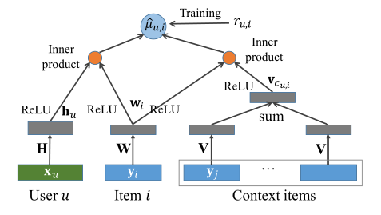

NPE
===========

Introduction
---------------------

`[paper] <https://arxiv.org/abs/1805.06563>`_

**Title:** NPE: Neural Personalized Embedding for Collaborative Filtering.

**Authors:** Ying, H

**Abstract:**  Matrix factorization is one of the most efficient approaches in recommender systems. However, such
algorithms, which rely on the interactions between
users and items, perform poorly for “cold-users”
(users with little history of such interactions) and
at capturing the relationships between closely related items. To address these problems, we propose
a neural personalized embedding (NPE) model,
which improves the recommendation performance
for cold-users and can learn effective representations of items. It models a user’s click to an item
in two terms: the personal preference of the user
for the item, and the relationships between this
item and other items clicked by the user. We show
that NPE outperforms competing methods for top-N 
recommendations, specially for cold-user recommendations. We also performed a qualitative analysis that shows the effectiveness
of the representations learned by the model.

Running with RecBole
-------------------------

**Model Hyper-Parameters:**

- ``embedding_size (int)`` : The embedding size of users and items. Defaults to ``64``.
- ``dropout_prob (float)`` : The dropout rate. Defaults to ``0.3``.
- ``loss_type (str)`` : The type of loss function. If it set to ``'CE'``, the training task is regarded as a multi-classification task and the target item is the ground truth. In this way, negative sampling is not needed. If it set to ``'BPR'``, the training task will be optimized in the pair-wise way, which maximize the difference between positive item and negative item. In this way, negative sampling is necessary, such as setting ``--neg_sampling="{'uniform': 1}"``. Defaults to ``'CE'``. Range in ``['BPR', 'CE']``.

**A Running Example:**

Write the following code to a python file, such as `run.py`

.. code:: python

   from recbole.quick_start import run_recbole

   parameter_dict = {
      'neg_sampling': None,
   }
   run_recbole(model='NPE', dataset='ml-100k', config_dict=parameter_dict)

And then:

.. code:: bash

   python run.py

**Notes:**

- By setting ``reproducibility=False``, the training speed of NPE can be greatly accelerated.

Tuning Hyper Parameters
-------------------------

If you want to use ``HyperTuning`` to tune hyper parameters of this model, you can copy the following settings and name it as ``hyper.test``.

.. code:: bash

   learning_rate choice [0.001]
   embedding_size choice [64]
   dropout_prob choice [0.2,0.3,0.5]

Note that we just provide these hyper parameter ranges for reference only, and we can not guarantee that they are the optimal range of this model.

Then, with the source code of RecBole (you can download it from GitHub), you can run the ``run_hyper.py`` to tuning:

.. code:: bash

	python run_hyper.py --model=[model_name] --dataset=[dataset_name] --config_files=[config_files_path] --params_file=hyper.test

For more details about Parameter Tuning, refer to :doc:`../../../user_guide/usage/parameter_tuning`.

If you want to change parameters, dataset or evaluation settings, take a look at

- :doc:`../../../user_guide/config_settings`
- :doc:`../../../user_guide/data_intro`
- :doc:`../../../user_guide/train_eval_intro`
- :doc:`../../../user_guide/usage`

