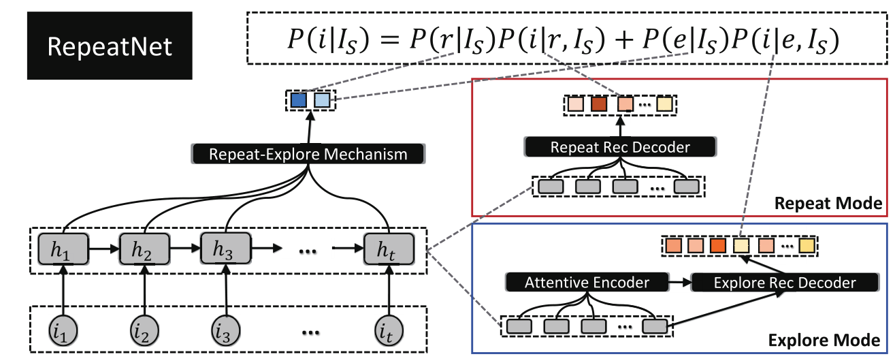

RepeatNet
===========

Introduction
---------------------

`[paper] <https://ojs.aaai.org//index.php/AAAI/article/view/4408>`_

**Title:** RepeatNet: A Repeat Aware Neural Recommendation Machine for Session-based Recommendation.

**Authors:** Pengjie Ren, Zhumin Chen, Jing Li, Zhaochun Ren, Jun Ma, Maarten de Rijke

**Abstract:**  Recurrent neural networks for session-based recommendation have attracted a lot of attention recently because of
their promising performance. repeat consumption is a common phenomenon in many recommendation scenarios (e.g.,e-commerce, music, and TV program recommendations),
where the same item is re-consumed repeatedly over time.
However, no previous studies have emphasized repeat consumption with neural networks. An effective neural approach
is needed to decide when to perform repeat recommendation. In this paper, we incorporate a repeat-explore mechanism into neural networks and propose a new model, called
RepeatNet, with an encoder-decoder structure. RepeatNet integrates a regular neural recommendation approach in the decoder 
with a new repeat recommendation mechanism that can
choose items from a user’s history and recommends them at
the right time. We report on extensive experiments on three
benchmark datasets. RepeatNet outperforms state-of-the-art
baselines on all three datasets in terms of MRR and Recall.
Furthermore, as the dataset size and the repeat ratio increase,
the improvements of RepeatNet over the baselines also increase, 
which demonstrates its advantage in handling repeat
recommendation scenarios.

Running with RecBole
-------------------------

**Model Hyper-Parameters:**

- ``embedding_size (int)`` : The embedding size of users and items. Defaults to ``64``.
- ``hidden_size (int)`` : The number of features in the hidden state. Defaults to ``64``.
- ``joint_train (bool)`` : The indicator whether the train loss should add the repeat_explore_loss. Defaults to ``False``.
- ``dropout_prob (float)`` : The dropout rate. Defaults to ``0.5``.
- ``loss_type (str)`` : The type of loss function. If it is set to ``'CE'``, the training task is regarded as a multi-classification task and the target item is the ground truth. In this way, negative sampling is not needed. If it is set to ``'BPR'``, the training task will be optimized in the pair-wise way, which maximizes the difference between the positive item and the negative one. In this way, negative sampling is necessary, such as setting ``--train_neg_sample_args="{'distribution': 'uniform', 'sample_num': 1}"``. Defaults to ``'CE'``. Range in ``['BPR', 'CE']``.

**A Running Example:**

Write the following code to a python file, such as `run.py`

.. code:: python

   from recbole.quick_start import run_recbole

   parameter_dict = {
      'train_neg_sample_args': None,
   }
   run_recbole(model='RepeatNet', dataset='ml-100k', config_dict=parameter_dict)

And then:

.. code:: bash

   python run.py

**Notes:**

- By setting ``reproducibility=False``, the training speed of RepeatNet can be greatly accelerated.

Tuning Hyper Parameters
-------------------------

If you want to use ``HyperTuning`` to tune hyper parameters of this model, you can copy the following settings and name it as ``hyper.test``.

.. code:: bash

   learning_rate choice [0.001,]
   embedding_size choice [64]
   joint_train choice [False,True]
   dropout_prob choice [0.5,]
   train_batch_size: 2048

Note that we just provide these hyper parameter ranges for reference only, and we can not guarantee that they are the optimal range of this model.

Then, with the source code of RecBole (you can download it from GitHub), you can run the ``run_hyper.py`` to tuning:

.. code:: bash

	python run_hyper.py --model=[model_name] --dataset=[dataset_name] --config_files=[config_files_path] --params_file=hyper.test

For more details about Parameter Tuning, refer to :doc:`../../../user_guide/usage/parameter_tuning`.

If you want to change parameters, dataset or evaluation settings, take a look at

- :doc:`../../../user_guide/config_settings`
- :doc:`../../../user_guide/data_intro`
- :doc:`../../../user_guide/train_eval_intro`
- :doc:`../../../user_guide/usage`

