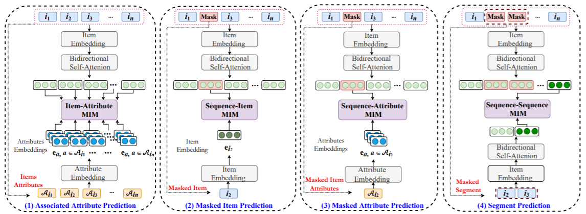

S3Rec
===========

Introduction
---------------------

`[paper] <https://dl.acm.org/doi/abs/10.1145/3340531.3411954>`_

**Title:** S3-Rec: Self-Supervised Learning for Sequential
Recommendation with Mutual Information Maximization

**Authors:** Kun Zhou, Hui Wang, Wayne Xin Zhao, Yutao Zhu, Sirui Wang, Fuzheng Zhang, Zhongyuan Wang, Ji-Rong Wen

**Abstract:**  Recently, significant progress has been made in sequential recommendation with deep learning. Existing neural sequential recommendation models usually rely on the item prediction loss to learn
model parameters or data representations. However, the model
trained with this loss is prone to suffer from data sparsity problem.
Since it overemphasizes the final performance, the association or
fusion between context data and sequence data has not been well
captured and utilized for sequential recommendation.
To tackle this problem, we propose the model S3-Rec, which
stands for Self-Supervised learning for Sequential Recommendation,
based on the self-attentive neural architecture. The main idea of
our approach is to utilize the intrinsic data correlation to derive
self-supervision signals and enhance the data representations via
pre-training methods for improving sequential recommendation.
For our task, we devise four auxiliary self-supervised objectives
to learn the correlations among attribute, item, subsequence, and
sequence by utilizing the mutual information maximization (MIM)
principle. MIM provides a unified way to characterize the correlation between different types of data, which is particularly suitable
in our scenario. Extensive experiments conducted on six real-world
datasets demonstrate the superiority of our proposed method over
existing state-of-the-art methods, especially when only limited
training data is available. Besides, we extend our self-supervised
learning method to other recommendation models, which also improve their performance.

Running with RecBole
-------------------------

**Model Hyper-Parameters:**

- ``hidden_size (int)`` : The number of features in the hidden state. It is also the initial embedding size of item. Defaults to ``64``.
- ``inner_size (int)`` : The inner hidden size in feed-forward layer. Defaults to ``256``.
- ``n_layers (int)`` : The number of transformer layers in transformer encoder. Defaults to ``2``.
- ``n_heads (int)`` : The number of attention heads for multi-head attention layer. Defaults to ``2``.
- ``hidden_dropout_prob (float)`` : The probability of an element to be zeroed. Defaults to ``0.5``.
- ``attn_dropout_prob (float)`` : The probability of an attention score to be zeroed. Defaults to ``0.5``.
- ``hidden_act (str)`` : The activation function in feed-forward layer. Defaults to ``'gelu'``. Range in ``['gelu', 'relu', 'swish', 'tanh', 'sigmoid']``.
- ``layer_norm_eps (float)``: A value added to the denominator for numerical stability. Defaults to ``1e-12``.
- ``initializer_range (float)`` : The standard deviation for normal initialization. Defaults to ``0.02``.
- ``mask_ratio (float)`` : The probability for a item replaced by MASK token. Defaults to ``0.2``.
- ``aap_weight (float)`` : The weight for Associated Attribute Prediction loss. Defaults to ``1.0``.
- ``mip_weight (float)`` : The weight for Masked Item Prediction loss. Defaults to ``0.2``.
- ``map_weight (float)`` : The weight for Masked Attribute Prediction loss. Defaults to ``1.0``.
- ``sp_weight (float)`` : The weight for Segment Prediction loss. Defaults to ``0.5``.
- ``train_stage (str)`` : The training stage. Defaults to ``'pretrain'``. Range in ``['pretrain', 'finetune']``.
- ``item_attribute (str)`` : The item features used as attributes for pre-training. Defaults to ``'class'`` for ml-100k dataset.
- ``pretrain_epochs (int)`` : The epochs of pre-training. Defaults to '500'.
- ``save_step (int)`` : Save pre-trained model every ``save_step`` pre-training epochs. Defaults to ``10``.
- ``pre_model_path (str)`` : The path of pretrained model. Defaults to ``''``.
- ``loss_type (str)`` : The type of loss function. If it is set to ``'CE'``, the training task is regarded as a multi-classification task and the target item is the ground truth. In this way, negative sampling is not needed. If it is set to ``'BPR'``, the training task will be optimized in the pair-wise way, which maximizes the difference between the positive item and the negative one. In this way, negative sampling is necessary, such as setting ``--train_neg_sample_args="{'distribution': 'uniform', 'sample_num': 1}"``. Defaults to ``'CE'``. Range in ``['BPR', 'CE']``.

**A Running Example:**

1. Run pre-training. Write the following code to `run_pretrain.py`

.. code:: python

   from recbole.quick_start import run_recbole

   config_dict = {
       'train_stage': 'pretrain',
       'save_step': 10,
   }
   run_recbole(model='S3Rec', dataset='ml-100k',
        config_dict=config_dict, saved=False)

And then:

.. code:: bash

   python run_pretrain.py

2. Run fine-tuning. Write the following code to `run_finetune.py`

.. code:: python

   from recbole.quick_start import run_recbole

   config_dict = {
       'train_stage': 'finetune',
       'pre_model_path': './saved/S3Rec-ml-100k-100.pth',
       'train_neg_sample_args': None
   }
   run_recbole(model='S3Rec', dataset='ml-100k',
        config_dict=config_dict)

And then:

.. code:: bash

   python run_finetune.py

**Notes:**

- In the pre-training stage, the pre-trained model would be saved every 10 epochs, named as ``S3Rec-[dataset_name]-[pretrain_epochs].pth`` (e.g. S3Rec-ml-100k-100.pth) and saved to ``./saved/``.

- In the fine-tuning stage, please make sure that the pre-trained model path is existed.

Tuning Hyper Parameters
-------------------------

If you want to use ``HyperTuning`` to tune hyper parameters of this model, you can copy the following settings and name it as ``hyper.test``.

.. code:: bash

   pretrain_epochs choice [50, 100, 150]

Note that we just provide these hyper parameter ranges for reference only, and we can not guarantee that they are the optimal range of this model.

Then, with the source code of RecBole (you can download it from GitHub), you can run the ``run_hyper.py`` to tuning:

.. code:: bash

    python run_hyper.py --model=[model_name] --dataset=[dataset_name] --config_files=[config_files_path] --params_file=hyper.test

For more details about Parameter Tuning, refer to :doc:`../../../user_guide/usage/parameter_tuning`.

If you want to change parameters, dataset or evaluation settings, take a look at

- :doc:`../../../user_guide/config_settings`
- :doc:`../../../user_guide/data_intro`
- :doc:`../../../user_guide/train_eval_intro`
- :doc:`../../../user_guide/usage`
