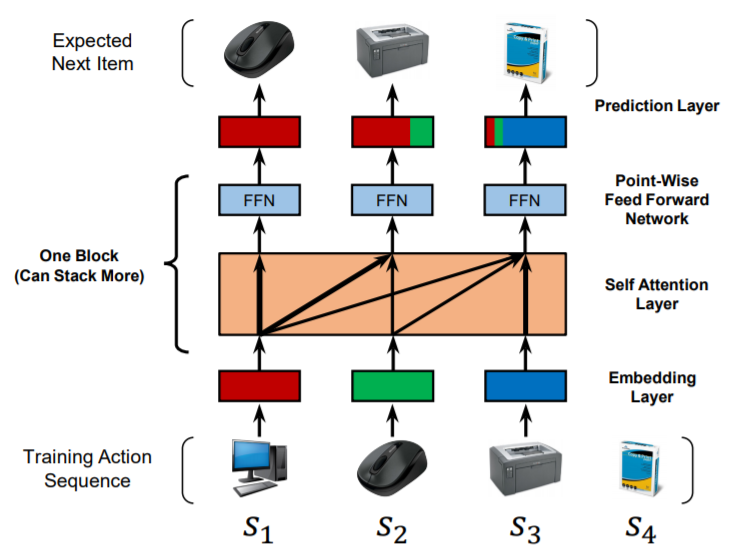

SASRec
===========

Introduction
---------------------

`[paper] <https://ieeexplore.ieee.org/document/8594844/>`_

**Title:** Self-Attentive Sequential Recommendation

**Authors:** Wang-Cheng Kang, Julian McAuley

**Abstract:**  Sequential dynamics are a key feature of many modern recommender systems,
which seek to capture the 'context' of users' activities on the basis of actions they have
performed recently. To capture such patterns, two approaches have proliferated: Markov Chains (MCs)
and Recurrent Neural Networks (RNNs). Markov Chains assume that a user's next action can be
predicted on the basis of just their last (or last few) actions, while RNNs in principle allow
for longer-term semantics to be uncovered. Generally speaking, MC-based methods perform best in
extremely sparse datasets, where model parsimony is critical, while RNNs perform better in denser
datasets where higher model complexity is affordable. The goal of our work is to balance these
two goals, by proposing a self-attention based sequential model (SASRec) that allows us to capture
long-term semantics (like an RNN), but, using an attention mechanism, makes its predictions based
on relatively few actions (like an MC). At each time step, SASRec seeks to identify which items
are 'relevant' from a user's action history, and use them to predict the next item. Extensive
empirical studies show that our method outperforms various state-of-the-art sequential
models (including MC/CNN/RNN-based approaches) on both sparse and dense datasets.
Moreover, the model is an order of magnitude more efficient than comparable CNN/RNN-based models.
Visualizations on attention weights also show how our model adaptively handles datasets with
various density, and uncovers meaningful patterns in activity sequences.

Running with RecBole
-------------------------

**Model Hyper-Parameters:**

- ``hidden_size (int)`` : The number of features in the hidden state. It is also the initial embedding size of item. Defaults to ``64``.
- ``inner_size (int)`` : The inner hidden size in feed-forward layer. Defaults to ``256``.
- ``n_layers (int)`` : The number of transformer layers in transformer encoder. Defaults to ``2``.
- ``n_heads (int)`` : The number of attention heads for multi-head attention layer. Defaults to ``2``.
- ``hidden_dropout_prob (float)`` : The probability of an element to be zeroed. Defaults to ``0.5``.
- ``attn_dropout_prob (float)`` : The probability of an attention score to be zeroed. Defaults to ``0.5``.
- ``hidden_act (str)`` : The activation function in feed-forward layer. Defaults to ``'gelu'``. Range in ``['gelu', 'relu', 'swish', 'tanh', 'sigmoid']``.
- ``layer_norm_eps (float)`` : A value added to the denominator for numerical stability, Defaults to ``1e-12``.
- ``initializer_range (float)`` : The standard deviation for normal initialization. Defaults to 0.02``.
- ``loss_type (str)`` : The type of loss function. If it set to ``'CE'``, the training task is regarded as a multi-classification task and the target item is the ground truth. In this way, negative sampling is not needed. If it set to ``'BPR'``, the training task will be optimized in the pair-wise way, which maximize the difference between positive item and negative item. In this way, negative sampling is necessary, such as setting ``--neg_sampling="{'uniform': 1}"``. Defaults to ``'CE'``. Range in ``['BPR', 'CE']``.

**A Running Example:**

Write the following code to a python file, such as `run.py`

.. code:: python

   from recbole.quick_start import run_recbole

   parameter_dict = {
      'neg_sampling': None,
   }
   run_recbole(model='SASRec', dataset='ml-100k', config_dict=parameter_dict)

And then:

.. code:: bash

   python run.py

Tuning Hyper Parameters
-------------------------

If you want to use ``HyperTuning`` to tune hyper parameters of this model, you can copy the following settings and name it as ``hyper.test``.

.. code:: bash

   learning_rate choice [0.01,0.005,0.001,0.0005,0.0001]
   attn_dropout_prob choice [0.2, 0.5]
   hidden_dropout_prob choice [0.2, 0.5]
   n_heads choice [1, 2]
   n_layers choice [1,2,3]

Note that we just provide these hyper parameter ranges for reference only, and we can not guarantee that they are the optimal range of this model.

Then, with the source code of RecBole (you can download it from GitHub), you can run the ``run_hyper.py`` to tuning:

.. code:: bash

	python run_hyper.py --model=[model_name] --dataset=[dataset_name] --config_files=[config_files_path] --params_file=hyper.test

For more details about Parameter Tuning, refer to :doc:`../../../user_guide/usage/parameter_tuning`.

If you want to change parameters, dataset or evaluation settings, take a look at

- :doc:`../../../user_guide/config_settings`
- :doc:`../../../user_guide/data_intro`
- :doc:`../../../user_guide/train_eval_intro`
- :doc:`../../../user_guide/usage`