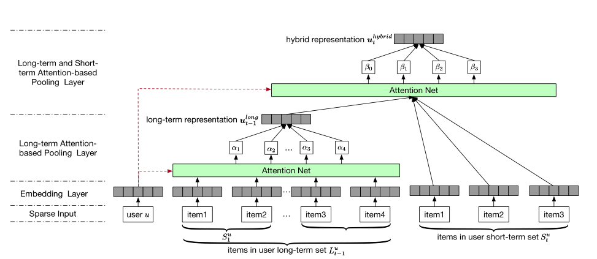

SHAN
===========

Introduction
---------------------

`[paper] <https://opus.lib.uts.edu.au/handle/10453/126040>`_

**Title:** SHAN: Sequential Recommender System based on Hierarchical Attention Network.

**Authors:** Ying, H

**Abstract:**  With a large amount of user activity data accumulated, it is crucial to exploit user sequential behavior for sequential recommendations. Conventionally, 
user general taste and recent demand are combined to promote recommendation performances.
However, existing methods often neglect that user
long-term preference keep evolving over time, and
building a static representation for user general
taste may not adequately reflect the dynamic characters. Moreover, they integrate user-item or item-item 
interactions through a linear way which limits 
the capability of model. To this end, in this
paper, we propose a novel two-layer hierarchical
attention network, which takes the above properties 
into account, to recommend the next item user
might be interested. Specifically, the first attention
layer learns user long-term preferences based on
the historical purchased item representation, while
the second one outputs final user representation
through coupling user long-term and short-term
preferences. The experimental study demonstrates
the superiority of our method compared with other
state-of-the-art ones.

Running with RecBole
-------------------------

**Model Hyper-Parameters:**

- ``embedding_size (int)`` : The embedding size of users and items. Defaults to ``64``.
- ``short_item_length (int)`` : The last N items . Defaults to ``2``.
- ``reg_weight (float)`` : The L2 regularization weight. Defaults to ``[0.01,0.0001]``.
- ``loss_type (str)`` : The type of loss function. If it set to ``'CE'``, the training task is regarded as a multi-classification task and the target item is the ground truth. In this way, negative sampling is not needed. If it set to ``'BPR'``, the training task will be optimized in the pair-wise way, which maximize the difference between positive item and negative item. In this way, negative sampling is necessary, such as setting ``--neg_sampling="{'uniform': 1}"``. Defaults to ``'CE'``. Range in ``['BPR', 'CE']``.

**A Running Example:**

Write the following code to a python file, such as `run.py`

.. code:: python

   from recbole.quick_start import run_recbole

   parameter_dict = {
      'neg_sampling': None,
   }
   run_recbole(model='SHAN', dataset='ml-100k', config_dict=parameter_dict)

And then:

.. code:: bash

   python run.py

**Notes:**

- By setting ``reproducibility=False``, the training speed of SHAN can be greatly accelerated.

Tuning Hyper Parameters
-------------------------

If you want to use ``HyperTuning`` to tune hyper parameters of this model, you can copy the following settings and name it as ``hyper.test``.

.. code:: bash

   learning_rate choice [0.001]
   embedding_size choice [64]
   short_item_length choice [1,2,4,8]
   reg_weight choice ['[0.0,0.0]','[0.01,0.0001]']

Note that we just provide these hyper parameter ranges for reference only, and we can not guarantee that they are the optimal range of this model.

Then, with the source code of RecBole (you can download it from GitHub), you can run the ``run_hyper.py`` to tuning:

.. code:: bash

	python run_hyper.py --model=[model_name] --dataset=[dataset_name] --config_files=[config_files_path] --params_file=hyper.test

For more details about Parameter Tuning, refer to :doc:`../../../user_guide/usage/parameter_tuning`.

If you want to change parameters, dataset or evaluation settings, take a look at

- :doc:`../../../user_guide/config_settings`
- :doc:`../../../user_guide/data_intro`
- :doc:`../../../user_guide/train_eval_intro`
- :doc:`../../../user_guide/usage`

