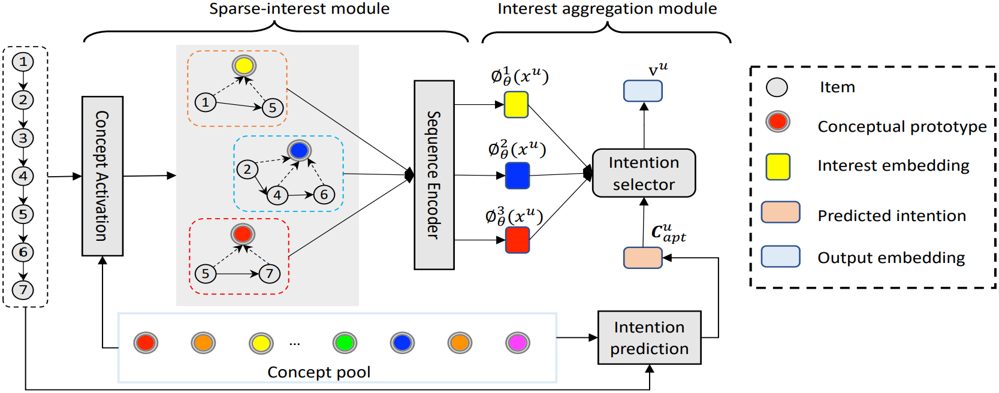

SINE
=================

Introduction
---------------------

`[paper] <https://doi.org/10.1145/3437963.3441811>`_

**Title:** Sparse-Interest Network for Sequential Recommendation

**Authors:** Qiaoyu Tan, Jianwei Zhang, Jiangchao Yao, Ninghao Liu, Jingren Zhou, Hongxia Yang and Xia Hu

**Abstract:**  Recent methods in sequential recommendation focus on learning an overall embedding vector 
from a user's behavior sequence for the next-item recommendation. However, from empirical 
analysis, we discovered that a user's behavior sequence often contains multiple conceptually 
distinct items, while a unified embedding vector is primarily affected by one's most recent 
frequent actions. Thus, it may fail to infer the next preferred item if conceptually similar 
items are not dominant in recent interactions. To this end, an alternative solution is to 
represent each user with multiple embedding vectors encoding different aspects of the user's 
intentions. Nevertheless, recent work on multi-interest embedding usually considers a small 
number of concepts discovered via clustering, which may not be comparable to the large pool of 
item categories in real systems. It is a non-trivial task to effectively model a large number 
of diverse conceptual prototypes, as items are often not conceptually well clustered in fine 
granularity. Besides, an individual usually interacts with only a sparse set of concepts. In 
light of this, we propose a novel Sparse Interest NEtwork (SINE) for sequential recommendation. 
Our sparse-interest module can adaptively infer a sparse set of concepts for each user from the 
large concept pool and output multiple embeddings accordingly. Given multiple interest embeddings, 
we develop an interest aggregation module to actively predict the user's current intention and 
then use it to explicitly model multiple interests for next-item prediction. Empirical results 
on several public benchmark datasets and one large-scale industrial dataset demonstrate that SINE 
can achieve substantial improvement over state-of-the-art methods.

Running with RecBole
-------------------------

**Model Hyper-Parameters:**

- ``embedding_size (int)`` : The input and output hidden size. Defaults to ``64``.
- ``layer_norm_eps (float)``: The value added to the denominator for numerical stability. Defaults to ``1e-12``.
- ``prototype_size (int)``: The size of latent prototypes. Defaults to ``50``.
- ``interest_size (int)`` : The number of intentions. Defaults to ``3``.
- ``tau_ratio (float)``: The tau value for temperature tuning. Defaults to ``0.1``.
- ``reg_loss_ratio (float)``: The L2 regularization weight. Defaults to ``0.5``.
- ``loss_type (str)`` : The type of loss function. If ``loss_type='CE'``, the training task is regarded as a multi-classification task and the target item is the ground truth. In this way, negative sampling is not needed. If ``loss_type='BPR'``, the training task will be optimized in the pair-wise way, which maximizes the difference between positive item and negative item. In this way, negative sampling is necessary, such as setting ``--neg_sampling="{'uniform': 1}"``. Defaults to ``'CE'``. Range in ``['BPR', 'CE']``.

**A Running Example:**

Write the following code to a python file, such as `run.py`

.. code:: python

   from recbole.quick_start import run_recbole

   parameter_dict = {
      'neg_sampling': None,
   }
   run_recbole(model='SINE', dataset='ml-100k', config_dict=parameter_dict)

And then:

.. code:: bash

   python run.py

Tuning Hyper Parameters
-------------------------

If you want to use ``HyperTuning`` to tune hyper parameters of this model, you can copy the following settings and name it as ``hyper.test``.

.. code:: bash

   learning_rate choice [0.01,0.005,0.001,0.0005,0.0001]
   prototype_size choice [50,100,500,1000,2000,5000]
   interest_size choice [4,8,12,16]

Note that we just provide these hyper parameter ranges for reference only, and we can not guarantee that they are the optimal range of this model.

Then, with the source code of RecBole (you can download it from GitHub), you can run the ``run_hyper.py`` to tuning:

.. code:: bash

	python run_hyper.py --model=[model_name] --dataset=[dataset_name] --config_files=[config_files_path] --params_file=hyper.test

For more details about Parameter Tuning, refer to :doc:`../../../user_guide/usage/parameter_tuning`.

If you want to change parameters, dataset or evaluation settings, take a look at

- :doc:`../../../user_guide/config_settings`
- :doc:`../../../user_guide/data_intro`
- :doc:`../../../user_guide/train_eval_intro`
- :doc:`../../../user_guide/usage`