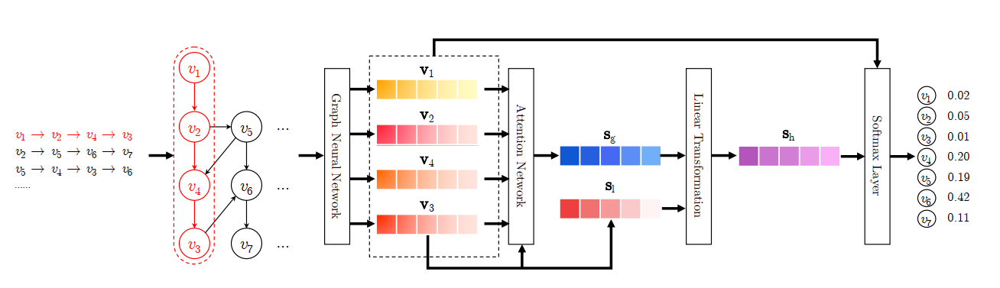

SRGNN
===========

Introduction
---------------------

`[paper] <https://www.aaai.org/ojs/index.php/AAAI/article/view/3804>`_

**Title:** Session-based Recommendation with Graph Neural Networks

**Authors:** Shu Wu, Yuyuan Tang, Yanqiao Zhu, Liang Wang, Xing Xie, Tieniu Tan

**Abstract:**  The problem of session-based recommendation aims to predict user actions based on anonymous sessions. Previous
methods model a session as a sequence and estimate user representations besides item representations to make recommendations. Though achieved promising results, they are insufficient to obtain accurate user vectors in sessions and neglect
complex transitions of items. To obtain accurate item embedding and take complex transitions of items into account, we
propose a novel method, i.e. Session-based Recommendation
with Graph Neural Networks, SR-GNN for brevity. In the
proposed method, session sequences are modeled as graphstructured data. Based on the session graph, GNN can capture complex transitions of items, which are difficult to be
revealed by previous conventional sequential methods. Each
session is then represented as the composition of the global
preference and the current interest of that session using an
attention network. Extensive experiments conducted on two
real datasets show that SR-GNN evidently outperforms the
state-of-the-art session-based recommendation methods consistently.

Running with RecBole
-------------------------

**Model Hyper-Parameters:**

- ``embedding_size (int)`` : The embedding size of items. Defaults to ``64``.
- ``step (int)`` : The number of layers in GNN. Defaults to ``1``.
- ``loss_type (str)`` : The type of loss function. If it is set to ``'CE'``, the training task is regarded as a multi-classification task and the target item is the ground truth. In this way, negative sampling is not needed. If it is set to ``'BPR'``, the training task will be optimized in the pair-wise way, which maximizes the difference between the positive item and the negative one. In this way, negative sampling is necessary, such as setting ``--train_neg_sample_args="{'distribution': 'uniform', 'sample_num': 1}"``. Defaults to ``'CE'``. Range in ``['BPR', 'CE']``.

**A Running Example:**

Write the following code to a python file, such as `run.py`

.. code:: python

   from recbole.quick_start import run_recbole

   parameter_dict = {
      'train_neg_sample_args': None,
   }
   run_recbole(model='SRGNN', dataset='ml-100k', config_dict=parameter_dict)

And then:

.. code:: bash

   python run.py

Tuning Hyper Parameters
-------------------------

If you want to use ``HyperTuning`` to tune hyper parameters of this model, you can copy the following settings and name it as ``hyper.test``.

.. code:: bash

   learning_rate choice [0.01,0.005,0.001,0.0005,0.0001]
   step choice [1, 2]

Note that we just provide these hyper parameter ranges for reference only, and we can not guarantee that they are the optimal range of this model.

Then, with the source code of RecBole (you can download it from GitHub), you can run the ``run_hyper.py`` to tuning:

.. code:: bash

	python run_hyper.py --model=[model_name] --dataset=[dataset_name] --config_files=[config_files_path] --params_file=hyper.test

For more details about Parameter Tuning, refer to :doc:`../../../user_guide/usage/parameter_tuning`.

If you want to change parameters, dataset or evaluation settings, take a look at

- :doc:`../../../user_guide/config_settings`
- :doc:`../../../user_guide/data_intro`
- :doc:`../../../user_guide/train_eval_intro`
- :doc:`../../../user_guide/usage`

