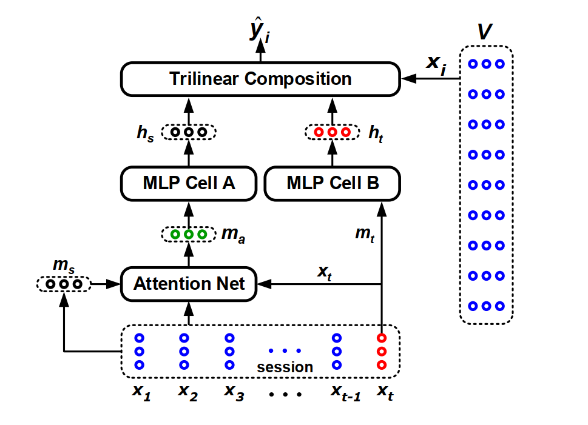

STAMP
===========

Introduction
---------------------

`[paper] <https://dl.acm.org/doi/abs/10.1145/3219819.3219950>`_

**Title:** STAMP: Short-Term Attention/Memory Priority Model for Session-based Recommendation

**Authors:** Qiao Liu, Yifu Zeng, Refuoe Mokhosi, Haibin Zhang

**Abstract:**  Predicting users' actions based on anonymous sessions is a 
hallenging problem in web-based behavioral modeling research, mainly
due to the uncertainty of user behavior and the limited information.
Recent advances in recurrent neural networks have led to promising
approaches to solving this problem, with long short-term memory
model proving effective in capturing users' general interests from
previous clicks. However, none of the existing approaches explicitly
take the effects of users' current actions on their next moves into
account. In this study, we argue that a long-term memory model
may be insufficient for modeling long sessions that usually contain
user interests drift caused by unintended clicks. A novel short-term
attention/memory priority model is proposed as a remedy, which is
capable of capturing users' general interests from the long-term memory 
of a session context, whilst taking into account users' current
interests from the short-term memory of the last-clicks. The validity
and efficacy of the proposed attention mechanism is extensively
evaluated on three benchmark data sets from the RecSys Challenge
2015 and CIKM Cup 2016. The numerical results show that our
model achieves state-of-the-art performance in all the tests.

Running with RecBole
-------------------------

**Model Hyper-Parameters:**

- ``embedding_size (int)`` : The embedding size of items. Defaults to ``64``.
- ``loss_type (str)`` : The type of loss function. If it is set to ``'CE'``, the training task is regarded as a multi-classification task and the target item is the ground truth. In this way, negative sampling is not needed. If it is set to ``'BPR'``, the training task will be optimized in the pair-wise way, which maximizes the difference between the positive item and the negative one. In this way, negative sampling is necessary, such as setting ``--train_neg_sample_args="{'distribution': 'uniform', 'sample_num': 1}"``. Defaults to ``'CE'``. Range in ``['BPR', 'CE']``.

**A Running Example:**

Write the following code to a python file, such as `run.py`

.. code:: python

   from recbole.quick_start import run_recbole

   parameter_dict = {
      'train_neg_sample_args': None,
   }
   run_recbole(model='STAMP', dataset='ml-100k', config_dict=parameter_dict)

And then:

.. code:: bash

   python run.py

Tuning Hyper Parameters
-------------------------

If you want to use ``HyperTuning`` to tune hyper parameters of this model, you can copy the following settings and name it as ``hyper.test``.

.. code:: bash

   learning_rate choice [0.01,0.005,0.001,0.0005,0.0001]

Note that we just provide these hyper parameter ranges for reference only, and we can not guarantee that they are the optimal range of this model.

Then, with the source code of RecBole (you can download it from GitHub), you can run the ``run_hyper.py`` to tuning:

.. code:: bash

	python run_hyper.py --model=[model_name] --dataset=[dataset_name] --config_files=[config_files_path] --params_file=hyper.test

For more details about Parameter Tuning, refer to :doc:`../../../user_guide/usage/parameter_tuning`.

If you want to change parameters, dataset or evaluation settings, take a look at

- :doc:`../../../user_guide/config_settings`
- :doc:`../../../user_guide/data_intro`
- :doc:`../../../user_guide/train_eval_intro`
- :doc:`../../../user_guide/usage`

