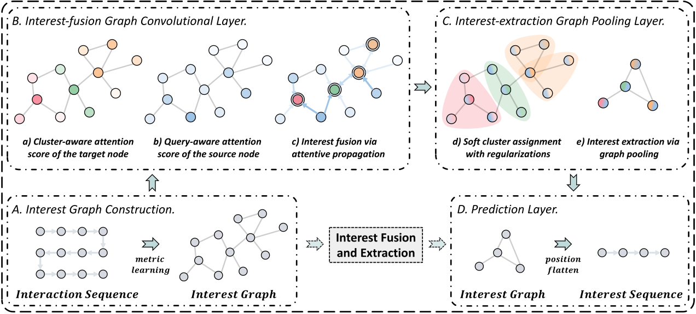

SURGE
===========

Introduction
---------------------

`[paper] <https://dl.acm.org/doi/abs/10.1145/3340531.3411954>`_

**Title:** Sequential Recommendation with Graph Neural Networks

**Authors:** Jianxin Chang, Chen Gao, Yu Zheng, Yiqun Hui, Yanan Niu, Yang Song, Depeng Jin, Yong Li

**Abstract:**  Sequential recommendation aims to leverage users' historical behaviors to predict their next interaction. Existing works have not yet addressed two main challenges in sequential recommendation. First, user behaviors in their rich historical sequences are often implicit and noisy preference signals, they cannot sufficiently reflect users' actual preferences. In addition, users' dynamic preferences often change rapidly over time, and hence it is difficult to capture user patterns in their historical sequences. In this work, we propose a graph neural network model called SURGE (short forSeqUential Recommendation with Graph neural nEtworks) to address these two issues. Specifically, SURGE integrates different types of preferences in long-term user behaviors into clusters in the graph by re-constructing loose item sequences into tight item-item interest graphs based on metric learning. This helps explicitly distinguish users' core interests, by forming dense clusters in the interest graph. Then, we perform cluster-aware and query-aware graph convolutional propagation and graph pooling on the constructed graph. It dynamically fuses and extracts users' current activated core interests from noisy user behavior sequences. We conduct extensive experiments on both public and proprietary industrial datasets. Experimental results demonstrate significant performance gains of our proposed method compared to state-of-the-art methods. Further studies on sequence length confirm that our method can model long behavioral sequences effectively and efficiently.

Running with RecBole
-------------------------

**Model Hyper-Parameters:**

- ``embedding_size (int)`` : The embedding size of items. Defaults to ``32``.
- ``hidden_size (int)`` : The number of features in the hidden state. Defaults to ``32``.
- ``layer_sizes (list)`` : The layers' size of DNN. Defaults to ``[100, 64]``.
- ``att_activation (str)`` : The activation function. Defaults to ``relu``.
- ``att_fcn_layer_sizes (list)`` : The layers' size of attention fcn layers. Defaults to ``[80, 40]``.
- ``relative_threshold (float)`` : The rate for keeping edges. Defaults to ``0.50``.
- ``pool_length (int)`` : The keeping length for graph pooling layers. Defaults to ``30``.
- ``pool_layers (int)`` : The number of graph pooling layer. Defaults to ``1``.
- ``attention_heads (int)`` : The number of attention head. Defaults to ``1``.
- ``metric_heads (int)`` : The number of head in metric learning. Defaults to ``1``.
- ``dropout_prob (float)``: The dropout rate. Defaults to ``0.0``.

**A Running Example:**

Write the following code to a python file, such as `run.py`

.. code:: python

   from recbole.quick_start import run_recbole
   
   run_recbole(model='SURGE', dataset='ml-100k')

And then:

.. code:: bash

   python run.py

Tuning Hyper Parameters
-------------------------

If you want to use ``HyperTuning`` to tune hyper parameters of this model, you can copy the following settings and name it as ``hyper.test``.

.. code:: bash

   learning_rate choice [0.01,0.005,0.001,0.0005,0.0001]
   dropout_prob choice [0.0,0.1,0.2,0.3,0.4,0.5]
   hidden_size choice [32,64]

Note that we just provide these hyper parameter ranges for reference only, and we can not guarantee that they are the optimal range of this model.

Then, with the source code of RecBole (you can download it from GitHub), you can run the ``run_hyper.py`` to tuning:

.. code:: bash

    python run_hyper.py --model=[model_name] --dataset=[dataset_name] --config_files=[config_files_path] --params_file=hyper.test

For more details about Parameter Tuning, refer to :doc:`../../../user_guide/usage/parameter_tuning`.

If you want to change parameters, dataset or evaluation settings, take a look at

- :doc:`../../../user_guide/config_settings`
- :doc:`../../../user_guide/data_intro`
- :doc:`../../../user_guide/train_eval_intro`
- :doc:`../../../user_guide/usage`
