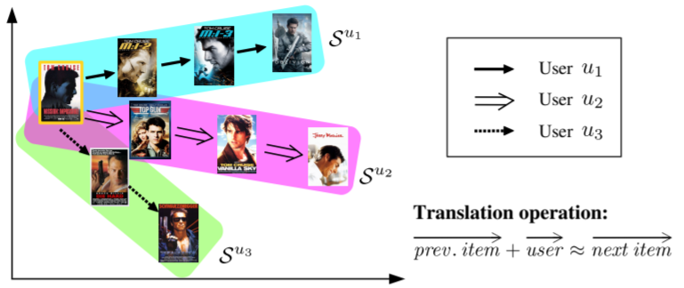

TransRec
===========

Introduction
---------------------

`[paper] <https://dl.acm.org/doi/10.1145/3109859.3109882>`_

**Title:** Translation-based Recommendation

**Authors:** Ruining He, Wang-Cheng Kang, Julian McAuley

**Abstract:**  Modeling the complex interactions between users and items as well
as amongst items themselves is at the core of designing successful recommender systems.
One classical setting is predicting users' personalized sequential behavior (or 'next-item'
recommendation), where the challenges mainly lie in modeling 'third-order' interactions
between a user, her previously visited item(s), and the next item to consume. Existing
methods typically decompose these higher-order interactions into a combination
of pairwise relationships, by way of which user preferences (user-item interactions)
and sequential patterns (item-item interactions) are captured by separate components.
In this paper, we propose a unified method, TransRec, to model such third-order relationships
for large-scale sequential prediction. Methodologically, we embed items into a
'transition space' where users are modeled as translation vectors operating on
item sequences. Empirically, this approach outperforms the state-of-the-art on
a wide spectrum of real-world datasets.

Running with RecBole
-------------------------

**Model Hyper-Parameters:**

- ``embedding_size (int)`` : The embedding size of items. Defaults to ``64``.

**A Running Example:**

Write the following code to a python file, such as `run.py`

.. code:: python

   from recbole.quick_start import run_recbole

   run_recbole(model='TransRec', dataset='ml-100k')

And then:

.. code:: bash

   python run.py

**Notes:**

- Different from other sequential models, TransRec must be optimized in pair-wise way using negative sampling, so it needs ``train_neg_sample_args={'uniform': 1}``.

Tuning Hyper Parameters
-------------------------

If you want to use ``HyperTuning`` to tune hyper parameters of this model, you can copy the following settings and name it as ``hyper.test``.

.. code:: bash

   learning_rate choice [0.01,0.005,0.001,0.0005,0.0001]
   train_batch_size choice [512, 1024, 2048]

Note that we just provide these hyper parameter ranges for reference only, and we can not guarantee that they are the optimal range of this model.

Then, with the source code of RecBole (you can download it from GitHub), you can run the ``run_hyper.py`` to tuning:

.. code:: bash

	python run_hyper.py --model=[model_name] --dataset=[dataset_name] --config_files=[config_files_path] --params_file=hyper.test

For more details about Parameter Tuning, refer to :doc:`../../../user_guide/usage/parameter_tuning`.

If you want to change parameters, dataset or evaluation settings, take a look at

- :doc:`../../../user_guide/config_settings`
- :doc:`../../../user_guide/data_intro`
- :doc:`../../../user_guide/train_eval_intro`
- :doc:`../../../user_guide/usage`
