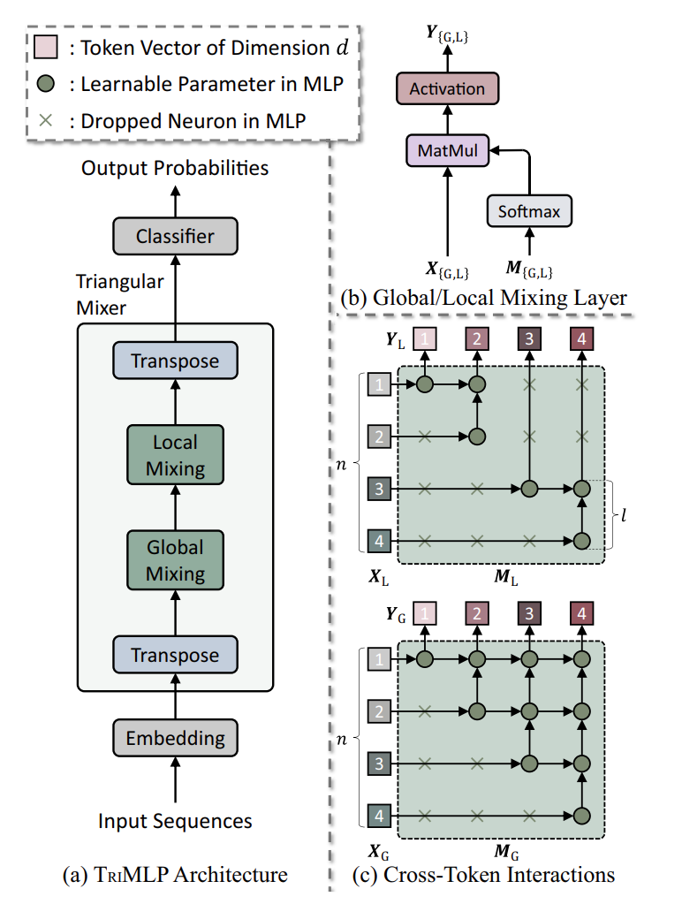

TriMLP
===========

Introduction
---------------------

`[paper] <https://dl.acm.org/doi/10.1145/3670995>`_

**Title:** TriMLP: A Foundational MLP-Like Architecture for Sequential Recommendation

**Authors:** Yiheng Jiang, Yuanbo Xu, Yongjian Yang, Funing Yang, Pengyang Wang, Chaozhuo Li, Fuzhen Zhuang, Hui Xiong

**Abstract:**  In this work, we present TriMLP as a foundational MLP-like architecture for the sequential recommendation, simultaneously achieving computational efficiency and promising performance. First, we empirically study the incompatibility between existing purely MLP-based models and sequential recommendation, that the inherent fully-connective structure endows historical user–item interactions (referred as tokens) with unrestricted communications and overlooks the essential chronological order in sequences. Then, we propose the MLP-based Triangular Mixer to establish ordered contact among tokens and excavate the primary sequential modeling capability under the standard auto-regressive training fashion. It contains (1) a global mixing layer that drops the lower-triangle neurons in MLP to block the anti-chronological connections from future tokens and (2) a local mixing layer that further disables specific upper-triangle neurons to split the sequence as multiple independent sessions. The mixer serially alternates these two layers to support fine-grained preferences modeling, where the global one focuses on the long-range dependency in the whole sequence, and the local one calls for the short-term patterns in sessions. Experimental results on 12 datasets of different scales from 4 benchmarks elucidate that TriMLP consistently attains favorable accuracy/efficiency tradeoff over all validated datasets, where the average performance boost against several state-of-the-art baselines achieves up to 14.88%, and the maximum reduction of inference time reaches 23.73%. The intriguing properties render TriMLP a strong contender to the well-established RNN-, CNN-, and Transformer-based sequential recommenders. Code is available at https://github.com/jiangyiheng1/TriMLP.

Running with RecBole
-------------------------

**Model Hyper-Parameters:**

- ``embedding_size (int)`` : The embedding size of items. Defaults to ``64``.
- ``act_fct (float)`` : The activation function in feed-forward layer. Defaults to ``'None'``. Range in ``['None', 'tanh', 'sigmoid']``.
- ``num_session (float)`` : The number of sessions per sequence. Defaults to ``2``.
- ``dropout_prob (float)`` : The dropout rate. Defaults to ``0.5``.
- ``loss_type (str)`` : The type of loss function. Is fixed to ``'CE'``.

**A Running Example:**

Write the following code to a python file, such as `run.py`

.. code:: python

   from recbole.quick_start import run_recbole

   parameter_dict = {
      'train_neg_sample_args': None,
   }
   run_recbole(model='TriMLP', dataset='ml-100k', config_dict=parameter_dict)

And then:

.. code:: bash

   python run.py

Tuning Hyper Parameters
-------------------------

If you want to use ``HyperTuning`` to tune hyper parameters of this model, you can copy the following settings and name it as ``hyper.test``.

.. code:: bash

   learning_rate choice [0.01, 0.005, 0.001, 0.0005, 0.0001]
   act_fct choice ['None', 'tanh', 'sigmoid']
   dropout_prob choice [0.2, 0.5]
   num_session choice [1, 2, 3, 4, 8, 16, 32]

Note that we just provide these hyper parameter ranges for reference only, and we can not guarantee that they are the optimal range of this model.

Then, with the source code of RecBole (you can download it from GitHub), you can run the ``run_hyper.py`` to tuning:

.. code:: bash

	python run_hyper.py --model=[model_name] --dataset=[dataset_name] --config_files=[config_files_path] --params_file=hyper.test

For more details about Parameter Tuning, refer to :doc:`../../../user_guide/usage/parameter_tuning`.

If you want to change parameters, dataset or evaluation settings, take a look at

- :doc:`../../../user_guide/config_settings`
- :doc:`../../../user_guide/data_intro`
- :doc:`../../../user_guide/train_eval_intro`
- :doc:`../../../user_guide/usage`