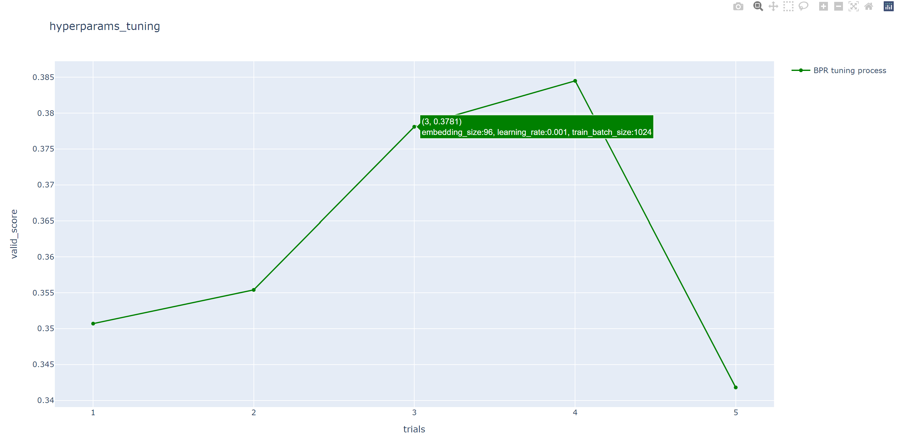

Parameter Tuning
=====================
RecBole is featured in the capability of automatic parameter
(or hyper-parameter) tuning. RecBole introduces Hyperopt and Ray for parameter tuning. One can readily optimize
a given model according to the provided hyper-parameter spaces.

 The general steps are given as follows:

To begin with Hyperopt, the user has to claim a
:class:`~recbole.trainer.hyper_tuning.HyperTuning`
instance in the running python file (e.g., `run_hyper.py`):

.. code:: python

    from recbole.trainer import HyperTuning
    from recbole.quick_start import objective_function

    hp = HyperTuning(objective_function=objective_function, algo='exhaustive', early_stop=10,
                    max_evals=100, params_file='model.hyper', fixed_config_file_list=['example.yaml'])

:attr:`objective_function` is the optimization objective,
the input of :attr:`objective_function` is the parameter,
and the output is the optimal result of these parameters.
The users can design this :attr:`objective_function` according to their own requirements.
The user can also use an encapsulated :attr:`objective_function`, that is:

.. code:: python

    def objective_function(config_dict=None, config_file_list=None):

        config = Config(config_dict=config_dict, config_file_list=config_file_list)
        init_seed(config['seed'])
        dataset = create_dataset(config)
        train_data, valid_data, test_data = data_preparation(config, dataset)
        model_name = config['model']
        model = get_model(model_name)(config, train_data._dataset).to(config['device'])
        trainer = get_trainer(config['MODEL_TYPE'], config['model'])(config, model)
        best_valid_score, best_valid_result = trainer.fit(train_data, valid_data, verbose=False)
        test_result = trainer.evaluate(test_data)

        return {
            'model': model_name,
            'best_valid_score': best_valid_score,
            'valid_score_bigger': config['valid_metric_bigger'],
            'best_valid_result': best_valid_result,
            'test_result': test_result
        }

:attr:`algo` is the optimization algorithm. RecBole support three tunning methods:
'exhaustive': grid search, in this case, 'max_evals' is auto set;
'random': random search, in this case, 'max_evals' needs to be set manually;
'bayes': Bayesian HyperOpt, in this case, 'max_evals' needs to be set manually.
In addition, we also support user-defined tunning method.

.. code:: python

    # Grid Search
    hp1 = HyperTuning(algo='exhaustive')

    # Random Search
    hp2 = HyperTuning(algo='random')

    # Bayesian HyperOpt
    hp3 = HyperTuning(algo='bayes')

    # User-Defined Search
    hp4 = HyperTuning(algo=your_function)

:attr:`params_file` is the ranges of the parameters, which is exampled as
(e.g., `model.hyper`):

.. code:: none

    learning_rate loguniform -8,0
    embedding_size choice [64,96,128]
    mlp_hidden_size choice ['[64,64,64]','[128,128]']

Each line represents a parameter and the corresponding search range.
There are three components: parameter name, range type, range.

:class:`~recbole.trainer.hyper_tuning.HyperTuning` supports four range types,
the details are as follows:

+----------------+---------------------------------+------------------------------------------------------------------+
| range type　   | 　　 range　　　　　　　　　　  | 　　 discription                                                 |
+================+=================================+==================================================================+
| choice         | options(list)                   | search in options                                                |
+----------------+---------------------------------+------------------------------------------------------------------+
| uniform        | low(int),high(int)              | search in uniform distribution: (low,high)                       |
+----------------+---------------------------------+------------------------------------------------------------------+
| loguniform     | low(int),high(int)              | search in uniform distribution: exp(uniform(low,high))           |
+----------------+---------------------------------+------------------------------------------------------------------+
| quniform       | low(int),high(int),q(int)       | search in uniform distribution: round(uniform(low,high)/q)*q     |
+----------------+---------------------------------+------------------------------------------------------------------+

It should be noted that if the parameters are list and the range type is choice,
then the inner list should be quoted, e.g., :attr:`mlp_hidden_size` in `model.hyper`.

.. _hyperopt: https://github.com/hyperopt/hyperopt

:attr:`fixed_config_file_list` is the fixed parameters, e.g., dataset related parameters and evaluation parameters.
These parameters should be aligned with the format in :attr:`config_file_list`. See details as :doc:`../config_settings`.

Calling method of HyperTuning like:

.. code:: python

    from recbole.trainer import HyperTuning
    from recbole.quick_start import objective_function

    hp = HyperTuning(objective_function=objective_function, algo='exhaustive', early_stop=10,
                    max_evals=100, params_file='model.hyper', fixed_config_file_list=['example.yaml'])

    # run
    hp.run()
    # export result to the file
    hp.export_result(output_file='hyper_example.result')
    # print best parameters
    print('best params: ', hp.best_params)
    # print best result
    print('best result: ')
    print(hp.params2result[hp.params2str(hp.best_params)])

Run like:

.. code:: bash

    python run_hyper.py --config_files=[config_files] --params_file=[params_file] --output_file=[output_file] --tool=Hyperopt

:attr:`config_files` is the config files containing fixed parameters, :attr:`params_file` is the file containing fixed parameters,:attr:`output_file` is the output file containing the results,
:attr:`tool` decides whether to use H or R should be selected in :attr:`['Hyperopt','Ray']` ,which can be controlled by the command line or the yaml configuration files.

For example:

.. code:: yaml

    dataset: ml-100k
    model: BPR

A simple example is to search the :attr:`learning_rate` and :attr:`embedding_size` in BPR, that is,

.. code:: bash

    running_parameters:
    {'embedding_size': 128, 'learning_rate': 0.005}
    current best valid score: 0.3795
    current best valid result:
    {'recall@10': 0.2008, 'mrr@10': 0.3795, 'ndcg@10': 0.2151, 'hit@10': 0.7306, 'precision@10': 0.1466}
    current test result:
    {'recall@10': 0.2186, 'mrr@10': 0.4388, 'ndcg@10': 0.2591, 'hit@10': 0.7381, 'precision@10': 0.1784}

    ...

    best params:  {'embedding_size': 64, 'learning_rate': 0.001}
    best result: {
        'best_valid_result': {'recall@10': 0.2169, 'mrr@10': 0.4005, 'ndcg@10': 0.235, 'hit@10': 0.7582, 'precision@10': 0.1598}
        'test_result': {'recall@10': 0.2368, 'mrr@10': 0.4519, 'ndcg@10': 0.2768, 'hit@10': 0.7614, 'precision@10': 0.1901}
    }

After running, we will also generate an HTML file, which contains a line chart to show the process of hyper parameter search.

To begin with ray, the user has to  initialize ray in the running pyhton file(e.g., `run_hyper.py`):

.. code:: python

   import ray
   ray.init()

Similar to Hyperopt, ray also requires :attr:`objective_function` as optimization target.
For the details of the :attr:`objective_function`, please refer to the introduction in Hyperopt above.

:attr:`Schedulers` is optimization algorithms which can early terminate bad trials, pause trials, clone trials, and alter hyperparameters of a running trial.
All Trial Schedulers take in a metric, which is a value returned in the result dict of your Trainable and is maximized or minimized according to mode.

.. code:: python

    from ray.tune.schedulers import ASHAScheduler

    scheduler = ASHAScheduler(
        metric="recall@10",
        mode="max",
        max_t=100,
        grace_period=1,
        reduction_factor=2)
    tune.run( ... , scheduler=asha_scheduler)

Calling :attr:`tune.run` for analyzing result like:

.. code:: python

    from ray import tune

    result = tune.run(
        tune.with_parameters(objective_function, config_file_list=config_file_list),
        config=config,
        num_samples=5,
        log_to_file=args.output_file,
        scheduler=scheduler,
        local_dir=local_dir,
        resources_per_trial={
            "gpu": 1
        }
    )
    best_trial = result.get_best_trial("recall@10", "max", "last")
    print("best params: ",best_trial.config)
    print("best result: ",best_trial.last_result)

To leverage GPUs, you must set :attr:`gpu` in :attr:`resources_per_trial`. 
This will automatically set :attr:`CUDA_VISIBLE_DEVICES` for each trial. 

Run like:

.. code:: bash

    python run_hyper.py --config_files=[config_files] --output_file=[output_file] --tool=Ray

Note that when using Ray to tune parameters, the working directory will become the ``local_dir`` which is set in ``run_hyper.py``, 
so you need to set the absolute path of the dataset in the config file.
For example:

.. code:: yaml

    dataset: ml-100k
    model: BPR
    data_path: /home/user/RecBole/dataset
    
A simple example is to search the :attr:`learning_rate` and :attr:`embedding_size` in BPR, that is,

.. code:: bash

   == Status ==
    Current time: 2022-07-23 22:33:19 (running for 00:02:12.90)
    Memory usage on this node: 19.5/125.8 GiB
    Using AsyncHyperBand: num_stopped=0
    Bracket: Iter 8.000: None | Iter 4.000: None | Iter 2.000: None | Iter 1.000: None
    Resources requested: 5.0/40 CPUs, 0/2 GPUs, 0.0/77.29 GiB heap, 0.0/37.12 GiB objects (0.0/1.0 accelerator_type:K40)
    Result logdir: /home/wangzhenlei/wanglei/dev-bole/RecBole/ray_log/objective_function_2022-07-23_22-31-06
    Number of trials: 5/5 (5 RUNNING)
    +--------------------------------+----------+----------------------+------------------+-----------------+
    | Trial name                     | status   | loc                  |   embedding_size |   learning_rate |
    |--------------------------------+----------+----------------------+------------------+-----------------|
    | objective_function_16400_00000 | RUNNING  | ***.***.***.**:21392 |                8 |     0.0542264   |
    | objective_function_16400_00001 | RUNNING  | ***.***.***.**:21443 |                8 |     0.00055313  |
    | objective_function_16400_00002 | RUNNING  | ***.***.***.**:21446 |                8 |     0.000639818 |
    | objective_function_16400_00003 | RUNNING  | ***.***.***.**:21448 |                8 |     0.00456223  |
    | objective_function_16400_00004 | RUNNING  | ***.***.***.**:21449 |                8 |     0.00265045  |
    +--------------------------------+----------+----------------------+------------------+-----------------+

    ...

    2022-07-23 22:35:22,868 INFO tune.py:748 -- Total run time: 256.58 seconds (256.42 seconds for the tuning loop).
    best params:  {'embedding_size': 8, 'learning_rate': 0.004562228847261371}
    best result:  {'recall@10': 0.2148, 'mrr@10': 0.4161, 'ndcg@10': 0.2489, 'hit@10': 0.7444, 'precision@10': 0.1761, 'time_this_iter_s': 227.5052626132965, 'done': True, 'timesteps_total': None, 'episodes_total': None, 'training_iteration': 1, 'trial_id': '16400_00003', 'experiment_id': '3864900644e743d5b75c67a2e904183a', 'date': '2022-07-23_22-34-59', 'timestamp': 1658586899, 'time_total_s': 227.5052626132965, 'pid': 21448, 'hostname': 'aibox-94', 'node_ip': '183.174.228.94', 'config': {'embedding_size': 8, 'learning_rate': 0.004562228847261371}, 'time_since_restore': 227.5052626132965, 'timesteps_since_restore': 0, 'iterations_since_restore': 1, 'warmup_time': 0.004939079284667969, 'experiment_tag': '3_embedding_size=8,learning_rate=0.0046'}

Users can use ray distributed tuning by changing :attr:`ray.init` as follows:

.. code:: python

    import ray
    ray.init(address='auto')

For details, please refer to Ray's official website https://docs.ray.io .
