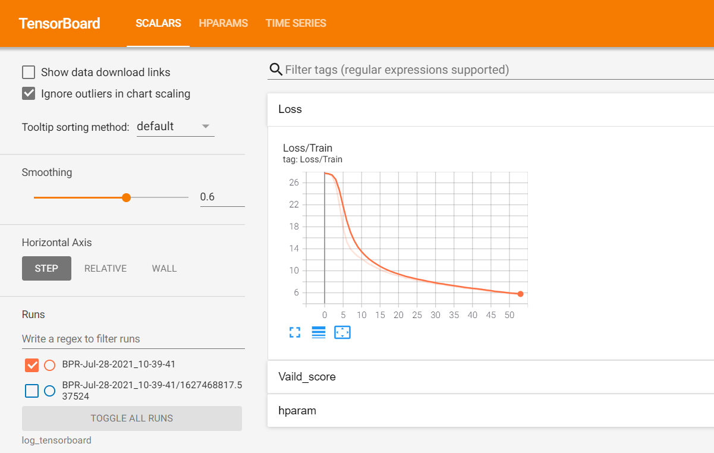
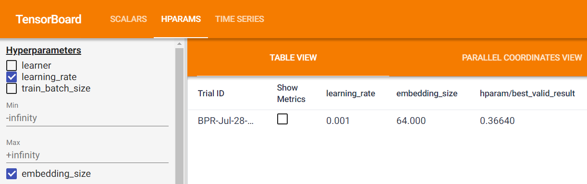

Use Tensorboard
====================

In the latest release, RecBole allows tracking and visualizing train loss and valid score with TensorBoard. 

In Recbole, TensorBoard output to `./log_tensorboard/` directory by default. You can start TensorBoard with:

.. code:: sh

    $ tensorboard --logdir=log_tensorboard

Then, go to the URL it provides OR to http://localhost:6006/. You can see the following page.

This dashboard shows how the train loss and valid score change with every epoch. 

You can also compare hyperparameters by switching to the  'HPAPAMS' page 
from the header menu. It’s helpful to compare these metrics across different training runs to improve your model.

